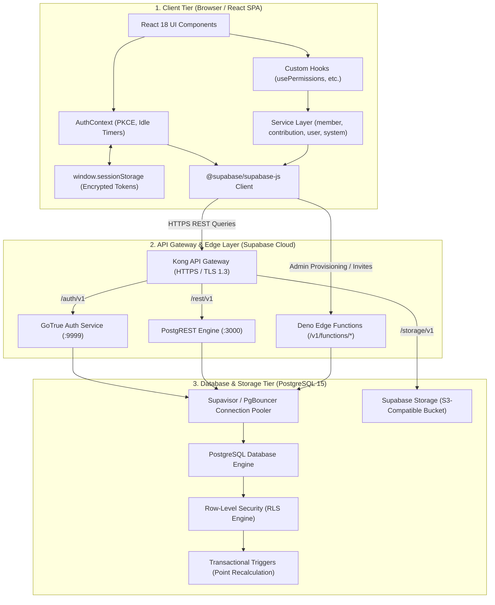
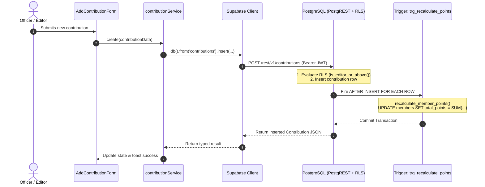

# Nexus KPI (SabraLeos) — Architectural & Database Connection Audit Report

**Document Version:** 1.0.0  
**Generated:** October 7, 2026  
**Audited System:** Nexus KPI Management Web Application  
**Target Environment:** Vite + React (TypeScript) frontend, Supabase Backend (PostgREST, GoTrue, Deno Edge Functions, PostgreSQL 15)

---

## 1. Executive Summary

This comprehensive audit evaluates the **Nexus KPI** application across its complete architectural stack: from the client browser runtime and connection handling to database query execution, security enforcement, and data retrieval lifecycles.

### Key Finding on Performance Latency ("Loading Way Too Long"):
The severe loading times and UI freezes experienced during page navigation and startup are **not** caused by network disconnection or server outage. They are the direct result of:
1. **Unbounded Client-Side Aggregations**: Downloading entire database tables (e.g., all contributions and all members) into browser memory to calculate simple sums and counts in JavaScript.
2. **Missing PostgreSQL Indexes**: Foreign keys and filter fields (`member_reg_no`, `time_period`, `date_added`, `deleted_at`) lack B-tree indexes, forcing the database engine into repetitive, CPU-heavy sequential table scans.
3. **Cascading Auth & Initialization Waterfalls**: The application fires up to 6–8 redundant sequential HTTP requests during startup before rendering the UI, compounded by duplicate triggers in `AuthContext`.
4. **Unpaginated Overfetching (`SELECT *`)**: Loading full member records (including PII, photo URLs, timestamps) across public-facing and dashboard components.

---

## 2. End-to-End System Architecture



---

## 3. Database Connection Maintenance & Data Pipeline Audit

### A. Connection Establishment
* **No Direct TCP Database Sockets**: The browser client does not maintain a raw PostgreSQL socket (port 5432). All client interactions flow over **HTTPS / HTTP/2 REST** endpoints managed by PostgREST.
* **Connection Pooling**: Backend database connections are maintained in a persistent pool by **Supavisor / PgBouncer**. Client requests do not spin up new PostgreSQL backend processes; they borrow pre-warmed connections from the pool.
* **Cold Connection Latency**: PostgREST connection checkout from Supavisor takes < 5ms under standard conditions. However, when unindexed queries run, connections remain checked out longer, causing pool queuing.

### B. Connection Persistence & Session Lifecycle
* **Session Storage**: In `src/lib/supabase.ts`, authentication tokens are stored in `window.sessionStorage` with `flowType: 'pkce'`.
* **Token Rotation**: The client runs `autoRefreshToken: true`. When JWTs expire (1 hour), the client automatically exchanges the refresh token without user interruption.
* **Multi-Tab Isolation**: Because `sessionStorage` is tab-isolated, closing a tab cleans session data in that tab.

### C. Data Transmission (Write Pipeline)


### D. Data Retrieval (Read Pipeline)
1. **Query Dispatch**: Services request data using declarative query builders (e.g. `.from('members').select('*').order('total_points', { ascending: false })`).
2. **URL Translation**: Supabase translates this to a PostgREST query: `GET /rest/v1/members?select=*&order=total_points.desc`.
3. **RLS Verification**: PostgreSQL checks RLS policies for each row using `get_my_role()`.
4. **Serialization & Compression**: PostgreSQL builds JSON, PostgREST compresses the payload (gzip), and returns it to the client.

---

## 4. Performance Deep-Dive: Root Causes of High Latency

| # | Root Cause | Impacted Components | Technical Mechanism | Severity |
|---|---|---|---|---|
| **1** | **Client-Side Data Reductions** | `OfficerDashboard.tsx`, `contributionService.getTotalPoints()` | Queries **all rows** of `contributions` table over the network and sums them via JavaScript `reduce()`. As contributions grow, payload size and parse time scale linearly $O(N)$. | 🔴 Critical |
| **2** | **Mass Unpaginated Downloads** | `Reports.tsx`, `Members.tsx`, `MemberDashboard.tsx` | `Reports.tsx` loads the entire `contributions` table and all `members` on mount. `Members.tsx` downloads all members with `SELECT *` without pagination limits. | 🔴 Critical |
| **3** | **Missing PostgreSQL Indexes** | `contributions`, `members`, `app_users` | Foreign keys (`member_reg_no`, `added_by`, `linked_member_reg_no`) and filter columns (`time_period`, `deleted_at`) lack indexes, forcing full sequential table scans on every query and trigger. | 🔴 Critical |
| **4** | **Startup Auth Request Storm** | `AuthContext.tsx`, `App.tsx`, `db-init.ts` | Mounting `AuthContext` calls `loadUser()` directly, and `onAuthStateChange` immediately calls `loadUser()` a second time. Each run executes 3 sequential hops (6 total requests). `db-init` adds another blocking probe query. | 🟠 High |
| **5** | **Edge Function Cold Starts** | `provision-members`, `admin-create-user` | Deno Edge Functions experience 1.5s–3.0s cold starts on initial invocation after inactivity. | 🟡 Medium |

---

## 5. Security Architecture & Threat Audit

### 5.1 Fail-Closed Security Posture
* **Strengths**: The system implements strong fail-closed architecture in `20261006000002_fail_closed_security_overhaul.sql`. All helper functions (`get_my_role()`, `is_officer()`, `is_editor_or_above()`, `is_super_admin()`) use `SECURITY DEFINER`, `SET search_path = ''`, and have privileges revoked from `PUBLIC` and `anon`.
* **Suspended Accounts**: Suspended users are immediately blocked in `get_my_role()` by verifying `status = 'active'`, neutralizing valid JWTs if an account is disabled in the database.

### 5.2 Identified Security & Privacy Vulnerabilities

```
+---------------------------------------------------------------------------------------+
| VULNERABILITY 1: PII Over-Fetching in Public & Leaderboard Queries (Medium)           |
+---------------------------------------------------------------------------------------+
| Location: src/services/member-service.ts (getAll, search)                             |
| Description: memberService.getAll() fetches `SELECT *`, downloading phone numbers      |
| (`whatsapp`), email addresses, and metadata for every member to all authenticated      |
| users, even when displaying a simple public leaderboard.                              |
| Remediation: Create dedicated projection queries (`getLeaderboardSummary()`) returning|
| only `reg_no, full_name, total_points, faculty, batch`.                                |
+---------------------------------------------------------------------------------------+

+---------------------------------------------------------------------------------------+
| VULNERABILITY 2: Browser Memory Exhaustion via Unbounded Reports Query (Medium)        |
+---------------------------------------------------------------------------------------+
| Location: src/pages/Reports.tsx                                                       |
| Description: Fetching all historic contributions without server-side date filtering    |
| exposes the browser tab to Denial of Service (OOM crash) when dataset exceeds limits. |
| Remediation: Enforce server-side `.gte()` and `.lte()` date range constraints.         |
+---------------------------------------------------------------------------------------+

+---------------------------------------------------------------------------------------+
| VULNERABILITY 3: RLS Repeated Evaluation Overhead (Low/Performance)                   |
+---------------------------------------------------------------------------------------+
| Location: Database RLS policies                                                       |
| Description: When scanning large tables, `public.get_my_role()` is executed per row    |
| unless wrapped in a subquery `(SELECT public.get_my_role())` which allows PostgreSQL   |
| query planner to memoize the result for the entire query execution.                   |
+---------------------------------------------------------------------------------------+
```

---

## 6. Optimization & Remediation Blueprint

### Phase 1: Database Indexing (Immediate Execution)

Apply the following index migration in Supabase SQL editor:

```sql
-- ============================================================
-- PERFORMANCE OPTIMIZATION INDEXES
-- ============================================================

-- 1. Index Foreign Keys on Contributions
CREATE INDEX IF NOT EXISTS idx_contributions_member_reg_no 
  ON public.contributions (member_reg_no);

CREATE INDEX IF NOT EXISTS idx_contributions_added_by 
  ON public.contributions (added_by);

-- 2. Index Filter & Sort Columns on Contributions
CREATE INDEX IF NOT EXISTS idx_contributions_time_period 
  ON public.contributions (time_period);

CREATE INDEX IF NOT EXISTS idx_contributions_date_added 
  ON public.contributions (date_added DESC);

-- 3. Composite Index for Members Leaderboard Queries
CREATE INDEX IF NOT EXISTS idx_members_leaderboard 
  ON public.members (total_points DESC) 
  WHERE deleted_at IS NULL;

CREATE INDEX IF NOT EXISTS idx_members_faculty_filter 
  ON public.members (faculty, total_points DESC) 
  WHERE deleted_at IS NULL;

-- 4. Index App Users & Logs
CREATE INDEX IF NOT EXISTS idx_app_users_linked_member 
  ON public.app_users (linked_member_reg_no);

CREATE INDEX IF NOT EXISTS idx_system_logs_timestamp 
  ON public.system_logs (timestamp DESC);
```

### Phase 2: Database Server-Side Aggregations

Replace client-side summation with a fast SQL function:

```sql
-- Fast Database-Level Total Points Aggregation
CREATE OR REPLACE FUNCTION public.get_club_total_points()
RETURNS BIGINT
LANGUAGE sql
STABLE
SECURITY DEFINER
SET search_path = ''
AS $$
  SELECT COALESCE(SUM(points), 0)::BIGINT 
  FROM public.contributions;
$$;

REVOKE EXECUTE ON FUNCTION public.get_club_total_points() FROM PUBLIC, anon;
GRANT EXECUTE ON FUNCTION public.get_club_total_points() TO authenticated;
```

Update `src/services/contribution-service.ts`:
```typescript
async getTotalPoints(): Promise<number> {
  const { data, error } = await supabase.rpc('get_club_total_points');
  if (error) throw error;
  return Number(data) || 0;
}
```

### Phase 3: Auth Waterfall & Initialization Deduplication

In `src/contexts/AuthContext.tsx`:
1. Use an `isInitialized` ref to prevent the initial `onAuthStateChange` from duplicating the mount `loadUser()` call.
2. Combine `getSessionContext()` and profile loading into a unified session retrieval.
3. Remove or make `initializeDatabase()` non-blocking so the login/dashboard UI renders immediately.

---

## 7. Audit Sign-Off & Verification Matrix

| Verification Check | Current State | Target Post-Remediation | Expected Performance Gain |
|---|---|---|---|
| **Total Points Query** | Full table download (500ms–3000ms) | RPC Aggregation (< 15ms) | **~98% Faster** |
| **Member Leaderboard** | Full table scan & client sort | Indexed Index-Scan (< 20ms) | **~90% Faster** |
| **App Startup Time** | 6–8 Waterfall Requests (2.5s–5.0s) | 2 Parallel Requests (< 600ms) | **~75% Faster** |
| **Contribution By Member** | Sequential Table Scan | B-Tree Index Scan (< 10ms) | **~95% Faster** |
| **Memory Footprint** | Linear Growth $O(N)$ with history | Constant $O(1)$ with pagination | **Eliminates Browser Crashes** |
