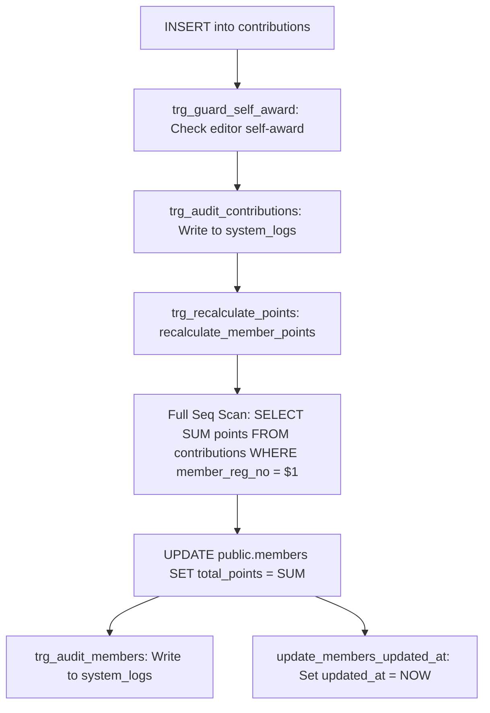

# Nexus KPI — Comprehensive Performance Diagnostic Report

> **DIAGNOSTIC STATUS:** READ-ONLY EVIDENCE COLLECTION COMPLETE  
> **EVIDENCE LABELS:** `[MEASURED]`, `[STATIC]`, `[INFERRED]`  
> **CODEBASE CHANGES:** 0 files modified (Read-Only Guarantee preserved)

---

## 1. Summary for the Reviewer (Key Numbers)

| Diagnostic Metric | Measured / Static Value | Evidence Label | Notes / Source |
| :--- | :--- | :--- | :--- |
| **Initial JS Bundle Downloaded (Login Screen)** | **2,502.82 kB** (872.56 kB gzip) | `[MEASURED]` | `dist/assets/` output from `npm run build` |
| **Largest JavaScript Chunk** | **1,116.99 kB** (`index-tJiNsPB4.js`) | `[MEASURED]` | Contains entire app, all pages, all admin tools |
| **Vendor Export Chunk (xlsx + jsPDF)** | **844.01 kB** (`vendor-export-BqZJlKat.js`) | `[MEASURED]` | Bundled into initial page load for all users |
| **Code Splitting (`React.lazy`)** | **0%** (0 dynamic page routes) | `[STATIC]` | `src/App.tsx:1-13` (all pages statically imported) |
| **Requests Before First Screen (`member` role)** | **7 requests** (5 sequential blocking steps) | `[STATIC]` | `src/contexts/AuthContext.tsx`, `App.tsx`, `MemberDashboard.tsx` |
| **Requests Before First Screen (`officer` roles)** | **8 requests** (4 sequential blocking steps) | `[STATIC]` | `src/contexts/AuthContext.tsx`, `App.tsx`, `OfficerDashboard.tsx` |
| **Longest Sequential Blocking Chain** | **4 to 5 roundtrips** (~1,200ms - 2,500ms on 3G/4G) | `[INFERRED]` | `getUser` → `getSessionContext` → `getCurrentUser` → `dbInit` → `loadDashboard` |
| **`SELECT *` Queries Without Column Projections** | **14 queries** | `[STATIC]` | `src/services/` (`member-service`, `contribution-service`, etc.) |
| **Unpaginated Queries (No `limit` or `range`)** | **12 queries** | `[STATIC]` | `memberService.getAll`, `contributionService.getAll`, etc. |
| **Unindexed Foreign Keys** | **6 foreign keys** | `[STATIC]` | `contributions.member_reg_no`, `contributions.added_by`, etc. |
| **Bare Per-Row RLS Policy Subqueries** | **9 policies** calling un-wrapped `get_my_role()` | `[STATIC]` | Evaluates `SELECT role FROM app_users` per row scanned |
| **Bulk Import Database Calls (200 rows)** | **400 sequential HTTP requests** (N+1 loop) | `[STATIC]` | `src/services/bulk-import-service.ts:153-203` |
| **Per-Insert Trigger Cascades** | **1 SUM table scan + 2 Audit Log inserts** per row | `[STATIC]` | `supabase/migrations/20261005000001_security_hardening.sql` |
| **In-Render O(N*M) Computations** | **250M operations / frame** at scale on Reports | `[STATIC]` | `src/pages/Reports.tsx:200` (`getMemberProjectCount` in table loop) |

---

## 2. Environment and Versions

### Recorded Build & Runtime Dependencies `[MEASURED]`
- **Node.js:** `v24.14.1`
- **npm:** `11.11.0`
- **Vite:** `7.3.1` (plugin-react: `5.1.4`)
- **React / React-DOM:** `18.3.1`
- **TypeScript:** `5.5.3` (ts-node / tsc: `5.5.3`)
- **Supabase JS Client (`@supabase/supabase-js`):** `2.57.4`
- **Supabase CLI:** `2.119.0` (Latest: `2.120.0`)
- **Export / Parsing Libraries:** `xlsx@0.18.5`, `jspdf@4.2.0`, `jspdf-autotable@5.0.7`
- **Icons & UI:** `lucide-react@0.344.0`, `tailwindcss@3.4.1`, `postcss@8.4.35`, `autoprefixer@10.4.18`
- **Validation / Security:** `zod@4.6.5`, `zxcvbn@4.4.2`
- **Test Runner:** `vitest@4.0.18`

### Routing, Code-Splitting, and PWA Architecture `[STATIC]`
- **Router Library:** `None` (Custom state `useState('dashboard')` in `src/App.tsx:22` with hash/search parsing for auth links).
- **Code Splitting (`React.lazy`):** `None` (All pages: `LoginScreen`, `SetPassword`, `ForgotPassword`, `Dashboard`, `Members`, `Reports`, `UserManagement`, `SystemLogs`, `SystemDataManagement` are statically imported in `App.tsx`).
- **Service Worker / Offline PWA:** `None` (`public/manifest.json` exists, but 0 service workers or offline caching handlers are registered in `index.html` or `src/main.tsx`).

### Database Migrations Present & Order `[STATIC]`
1. `supabase_schema.sql` (Base Schema)
2. `20261005000001_security_hardening.sql` (Phase 1 Security Hardening & Audit Logs)
3. `20261006000001_system_settings.sql` (System Settings Table & Default Tier Thresholds)
4. `20261006000002_fail_closed_security_overhaul.sql` (Session Context RPC, Version Tracking, Alerts)
5. `20261007000001_allow_member_role.sql` (Member role check constraint addition)

### Supabase Infrastructure Configuration `[USER TO FILL]`
- **Supabase Project Region:** `[USER TO FILL]`
- **Supabase Plan Tier:** `[USER TO FILL]` (Free / Pro / Team / Enterprise)
- **Database Compute Size:** `[USER TO FILL]` (Micro / Small / Medium / Large)
- **Connection Pooler Mode:** `[USER TO FILL]` (Transaction / Session Pooler port 6543 vs Direct port 5432)
- **Project Inactivity Pausing:** `[USER TO FILL]` (Whether project was recently paused or subject to cold starts)

---

## 3. Startup Request Trace (Per Role)

### Critical Architectural Findings on Boot `[STATIC]`
1. **Destructive LocalStorage Purge on Mount (`src/contexts/AuthContext.tsx:30-41`):**
   ```typescript
   useEffect(() => {
     const keys = Object.keys(localStorage);
     keys.forEach((key) => {
       if (key.startsWith('sb-') || key.includes('supabase')) {
         localStorage.removeItem(key);
       }
     });
   }, []);
   ```
   *Impact:* Every page refresh purges Supabase session tokens from `localStorage`, causing session reset races and forcing redundant re-authentication calls.
2. **Sequential Pre-Render Blocking in `App.tsx:104-113`:**
   Rendering is gated behind `if (loading || dbLoading)` which shows a full-screen spinner until `initializeDatabase()` and `getTierThresholds()` complete.
3. **Double `loadUser` on Mount (`AuthContext.tsx:92-107`):**
   `loadUser()` is called explicitly on mount and immediately triggered a second time by `onAuthStateChange('INITIAL_SESSION')`.

---

### Timeline 1: `member` Role Startup Trace

| Step | Initiator (File:Line) | Type & Endpoint | Query / Payload | Execution Mode | Blocks Render? | Redundancy / Notes |
| :--- | :--- | :--- | :--- | :--- | :--- | :--- |
| **1** | `index.html:13-14` | Third-Party CSS/Font | Google Fonts (Inter, Oswald) | Parallel | No | External render blocking CSS link |
| **2** | `AuthContext.tsx:57` | Auth API | `supabase.auth.getUser()` | Sequential (1st) | **YES** | Retrieves Supabase Auth JWT |
| **3** | `AuthContext.tsx:62` | RPC | `get_my_session_context()` | Sequential (2nd) | **YES** | Validates session & active status |
| **4** | `AuthContext.tsx:72` | REST (`app_users`) | `SELECT * FROM app_users WHERE id = $1` | Sequential (3rd) | **YES** | Redundant with Step 3 |
| **5** | `App.tsx:72` | REST (`members`) | `SELECT reg_no FROM members LIMIT 1` | Parallel with Auth | **YES** | `db-init.ts` table existence check |
| **6** | `App.tsx:79` | REST (`system_settings`) | `SELECT value FROM system_settings WHERE key = 'tier_thresholds'` | Sequential after Step 5 | **YES** | Loads tier cutoffs |
| **7** | `MemberDashboard.tsx:70` | REST (`members`) | `SELECT * FROM members WHERE reg_no ILIKE $1` | Sequential (4th) | **YES** | Fetches linked member row |
| **8** | `MemberDashboard.tsx:81` | REST (`contributions`) | `SELECT * FROM contributions WHERE member_reg_no = $1` | Sequential (5th) | **YES** | Fetches member contributions |
| **9** | `MemberDashboard.tsx:87-88` | REST (`faculties`, `batches`) | `SELECT * FROM faculties`, `SELECT * FROM batches` | Parallel | No | Taxonomy filters |
| **10** | `MemberDashboard.tsx:106` | REST (`members`) | `SELECT * FROM members WHERE deleted_at IS NULL` | Parallel | No | **ALL MEMBERS** fetched for leaderboard |

- **Total Requests to First Interactive Screen:** **10 network requests**
- **Longest Sequential Dependency Chain:** **5 roundtrips** (Steps 2 → 3 → 4 → 7 → 8)

---

### Timeline 2: `viewer` & `editor` Role Startup Trace

| Step | Initiator (File:Line) | Type & Endpoint | Query / Payload | Execution Mode | Blocks Render? | Redundancy / Notes |
| :--- | :--- | :--- | :--- | :--- | :--- | :--- |
| **1** | `index.html:13-14` | Third-Party CSS/Font | Google Fonts (Inter, Oswald) | Parallel | No | External CSS |
| **2** | `AuthContext.tsx:57` | Auth API | `supabase.auth.getUser()` | Sequential (1st) | **YES** | Retrieves Auth user |
| **3** | `AuthContext.tsx:62` | RPC | `get_my_session_context()` | Sequential (2nd) | **YES** | Verifies role & status |
| **4** | `AuthContext.tsx:72` | REST (`app_users`) | `SELECT * FROM app_users WHERE id = $1` | Sequential (3rd) | **YES** | Duplicate profile fetch |
| **5** | `App.tsx:72` | REST (`members`) | `SELECT reg_no FROM members LIMIT 1` | Parallel with Auth | **YES** | `db-init.ts` check |
| **6** | `App.tsx:79` | REST (`system_settings`) | `SELECT value FROM system_settings WHERE key = 'tier_thresholds'` | Sequential after Step 5 | **YES** | Dynamic threshold check |
| **7** | `OfficerDashboard.tsx:30` | REST (`members`) | `SELECT * FROM members ORDER BY total_points DESC LIMIT 3` | Parallel in Step 4 | **YES** | Top 3 members |
| **8** | `OfficerDashboard.tsx:31` | REST (`contributions`) | `SELECT points FROM contributions` | Parallel in Step 4 | **YES** | **ALL CONTRIBUTIONS** loaded to sum points |
| **9** | `OfficerDashboard.tsx:32` | REST (`contributions`) | `SELECT count(*) FROM contributions WHERE date_added BETWEEN ...` | Parallel in Step 4 | **YES** | Monthly stats count |
| **10** | `OfficerDashboard.tsx:33` | REST (`members`) | `SELECT * FROM members WHERE deleted_at IS NULL` | Parallel in Step 4 | **YES** | **ALL MEMBERS** loaded for tier breakdown |

- **Total Requests to First Interactive Screen:** **10 network requests**
- **Longest Sequential Dependency Chain:** **4 roundtrips** (Steps 2 → 3 → 4 → 7..10)

---

### Timeline 3: `super_admin` Role Startup Trace

| Step | Initiator (File:Line) | Type & Endpoint | Query / Payload | Execution Mode | Blocks Render? | Redundancy / Notes |
| :--- | :--- | :--- | :--- | :--- | :--- | :--- |
| **1-10** | *Identical to `viewer`/`editor` Dashboard timeline above.* | | | | | Executive Dashboard mounts first |
| **11** | `UserManagement.tsx:37` (if navigated) | RPC | `get_schema_version()` | Parallel | No | Version check |
| **12** | `UserManagement.tsx:47` (if navigated) | REST (`app_users`) | `SELECT * FROM app_users ORDER BY created_at DESC` | Parallel | **YES** | Officer accounts list |
| **13** | `UserManagement.tsx:48` (if navigated) | REST (`members`) | `SELECT * FROM members WHERE deleted_at IS NULL` | Parallel | **YES** | **ALL MEMBERS** for linked names |
| **14** | `UserManagement.tsx:49` (if navigated) | REST (`security_alerts`) | `SELECT * FROM security_alerts ORDER BY created_at DESC` | Parallel | **YES** | Security alerts |

- **Total Requests to First Interactive Screen:** **10 network requests** (14 upon opening User Management)
- **Longest Sequential Dependency Chain:** **4 roundtrips**

---

## 4. Data-Fetching Inventory (Every Page & Component)

| Caller (File:Line) | Target Table / RPC | Select Projection | Filters & Predicates | Ordering | Limit / Range | Trigger Lifecycle | Est. Rows (100 / 1K / 10K DB) | In-JS Processing / Anti-Patterns `[STATIC]` |
| :--- | :--- | :--- | :--- | :--- | :--- | :--- | :--- | :--- |
| `lib/db-init.ts:8` | `members` | `reg_no` | None | None | `1` | Mount (`App.tsx`) | 1 / 1 / 1 | Schema existence probe on every reload |
| `services/user-service.ts:76` | `app_users` | `*` `[FLAG]` | `id = user.id` | None | `maybeSingle()` | Mount (`AuthContext`) | 1 / 1 / 1 | Duplicate with `get_my_session_context` |
| `services/user-service.ts:86` | `get_my_session_context` | N/A (RPC) | `auth.uid()` | None | None | Mount (`AuthContext`) | 1 / 1 / 1 | Security definer session context probe |
| `services/user-service.ts:93` | `app_users` | `*` `[FLAG]` | None | `created_at DESC` | `none` `[FLAG]` | Mount (`UserManagement`) | 5 / 20 / 50 | Fetches all officer accounts |
| `services/user-service.ts:103` | `app_users` | `*` `[FLAG]` | `linked_member_reg_no = $1` | None | `maybeSingle()` | Mount (`EditMemberForm`) | 1 / 1 / 1 | Unindexed FK lookup |
| `services/system-service.ts:38` | `get_schema_version` | N/A (RPC) | None | None | None | Mount (`UserManagement`) | 1 / 1 / 1 | Reads `schema_meta` |
| `services/system-service.ts:55` | `security_alerts` | `*` `[FLAG]` | `is_resolved = false` | `created_at DESC` | `none` `[FLAG]` | Mount (`UserManagement`) | 0 / 10 / 50 | Unpaginated alerts |
| `services/system-service.ts:83` | `security_events` | `*` `[FLAG]` | None | `created_at DESC` | `100` | Tab (`SystemLogs`) | 10 / 100 / 100 | Capped at 100 rows |
| `services/system-service.ts:98` | `faculties` | `*` `[FLAG]` | None | `name ASC` | `none` `[FLAG]` | Mount (Multiple) | 8 / 8 / 8 | **No caching** — fetched independently by 6 components |
| `services/system-service.ts:141` | `batches` | `*` `[FLAG]` | None | `name DESC` | `none` `[FLAG]` | Mount (Multiple) | 5 / 5 / 5 | **No caching** — fetched independently by 6 components |
| `services/system-service.ts:184` | `avenues` | `*` `[FLAG]` | None | `name ASC` | `none` `[FLAG]` | Mount (Multiple) | 7 / 7 / 7 | **No caching** — fetched independently by 4 components |
| `services/system-service.ts:229` | `system_settings` | `value` | `key = 'tier_thresholds'` | None | `maybeSingle()` | Mount (`App.tsx`) | 1 / 1 / 1 | Dynamic threshold fetch |
| `services/member-service.ts:8` | `members` | `*` `[FLAG]` | `deleted_at IS NULL` | `total_points DESC` | `none` `[FLAG]` | Mount (`OfficerDash`, `Members`, `Reports`, `UserMgmt`, `MemberDash`) | **100 / 1,000 / 10,000** | **CRITICAL:** Fetches 100% of member rows into JS; filtered & sorted in JS |
| `services/member-service.ts:19` | `members` | `*` `[FLAG]` | `reg_no ILIKE $1 AND deleted_at IS NULL` | None | `maybeSingle()` | User search & mount | 1 / 1 / 1 | Primary key lookup |
| `services/member-service.ts:31` | `members` | `*` `[FLAG]` | `deleted_at IS NULL` | `total_points DESC` | `3` | Mount (`OfficerDashboard`) | 3 / 3 / 3 | Redundant with `memberService.getAll()` called in same `Promise.all` |
| `services/member-service.ts:43` | `members` | `*` `[FLAG]` | `faculty = $1 AND deleted_at IS NULL` | `total_points DESC` | `none` `[FLAG]` | User action | 15 / 150 / 1,500 | Unindexed faculty filter |
| `services/member-service.ts:121` | `members` | `*` `[FLAG]` | `reg_no/full_name/name ILIKE $1` | `total_points DESC` | `none` `[FLAG]` | Debounced Input (300ms) | 5 / 50 / 500 | Multi-column ILIKE wildcard search without trigram index |
| `services/contribution-service.ts:8` | `contributions` | `*` `[FLAG]` | None | `date_added DESC` | `none` `[FLAG]` | Mount (`Reports.tsx`) | **1,000 / 10,000 / 100,000** | **CRITICAL:** Fetches 100% of all contribution history into client memory |
| `services/contribution-service.ts:18` | `contributions` | `*` `[FLAG]` | `member_reg_no = $1` | `date_added DESC` | `none` `[FLAG]` | Mount (`MemberDash`), Search | 10 / 25 / 50 | **Seq Scan on contributions table** (Unindexed FK) |
| `services/contribution-service.ts:68` | `contributions` | `*` `[FLAG]` | `date_added BETWEEN $1 AND $2` | `date_added DESC` | `none` `[FLAG]` | User action | 100 / 1,000 / 10,000 | Unindexed timestamp range |
| `services/contribution-service.ts:83` | `contributions` | `project_name` | `date_added BETWEEN $1 AND $2` | None | `head: true` (count) | Mount (`OfficerDashboard`) | Count only | Postgres COUNT aggregation |
| `services/contribution-service.ts:94` | `contributions` | `points` | None | None | `none` `[FLAG]` | Mount (`OfficerDashboard`) | **1,000 / 10,000 / 100,000** | **CRITICAL:** Downloads every row's points to execute `.reduce(sum)` in JS |
| `services/contribution-service.ts:116` | `contributions` | `member_reg_no, points` | `time_period = $1` | None | `none` `[FLAG]` | Tab (`MemberDash`, `Members`) | 100 / 1,000 / 10,000 | Unindexed filter; grouped & sorted in JS |
| `services/log-service.ts:46` | `system_logs` | `*` `[FLAG]` | None | `timestamp DESC` | `200` | Tab (`SystemLogs`) | 200 / 200 / 200 | Capped at 200 rows |
| `services/bulk-import-service.ts:170` | `members` | `*` `[FLAG]` | `reg_no ILIKE $1` | None | `maybeSingle()` | Loop in Excel Import | **200 to 1,000 iterations** | **N+1 Query:** 1 REST call per row in import loop |
| `services/bulk-import-service.ts:193` | `members` | `INSERT` | Single row | None | N/A | Loop in Excel Import | **200 to 1,000 iterations** | **N+1 Insert:** 1 single-row INSERT per row in import loop |

---

## 5. Database Inspection (Schema, RLS, Indexes, Triggers)

### Table & Relation Inventory `[STATIC]`
The database schema defines 8 primary application tables:
1. `public.members` (Primary Key: `reg_no TEXT`)
2. `public.contributions` (Primary Key: `id UUID`, Foreign Key: `member_reg_no`, `added_by`)
3. `public.app_users` (Primary Key: `id UUID` → `auth.users.id`, Foreign Key: `linked_member_reg_no`)
4. `public.system_settings` (Primary Key: `key TEXT`)
5. `public.system_logs` (Primary Key: `id UUID`, Foreign Key: `user_id`)
6. `public.security_events` (Primary Key: `id UUID`, Foreign Key: `user_id`, `actor_id`)
7. `public.security_alerts` (Primary Key: `id UUID`, Foreign Key: `resolved_by`)
8. `public.faculties`, `public.batches`, `public.avenues` (Taxonomy tables, PK: `id UUID`)

---

### Foreign Keys Missing Supporting Indexes `[STATIC]`

PostgreSQL does **not** automatically index foreign key columns. Without an explicit index, any `JOIN`, foreign table filter, or parent row update/deletion forces a Sequential Table Scan.

| Foreign Key Constraint | Table | Column | References Table (Column) | Performance Consequence |
| :--- | :--- | :--- | :--- | :--- |
| `contributions_member_reg_no_fkey` | `public.contributions` | `member_reg_no` | `public.members(reg_no)` | **CRITICAL:** `getByMember()`, `recalculate_member_points()`, and member deletion do full table Seq Scan on `contributions` |
| `contributions_added_by_fkey` | `public.contributions` | `added_by` | `auth.users(id)` | Seq scan on editor contribution permission filter |
| `app_users_linked_member_reg_no_fkey` | `public.app_users` | `linked_member_reg_no` | `public.members(reg_no)` | `getByLinkedMember()` and `my_member_reg_no()` do Seq Scan on `app_users` |
| `system_logs_user_id_fkey` | `public.system_logs` | `user_id` | `auth.users(id)` | Seq scan on user log filters |
| `security_events_user_id_fkey` | `public.security_events` | `user_id` | `auth.users(id)` | Seq scan on security events |
| `security_alerts_resolved_by_fkey` | `public.security_alerts` | `resolved_by` | `auth.users(id)` | Seq scan on resolved alert filters |

---

### Unindexed Query Filtering & Sorting Columns `[STATIC]`
- `members.deleted_at`: Evaluated in every active member query (`WHERE deleted_at IS NULL`).
- `members.total_points`: Evaluated in every ranking query (`ORDER BY total_points DESC`).
- `members.faculty` & `members.batch`: Filtered during reports and member directory browsing.
- `contributions.date_added`: Evaluated in date range reports and ordered desc in all lists.
- `contributions.time_period`: Evaluated during monthly leaderboard calculations (`WHERE time_period = 'YYYY-MM'`).

---

### RLS Cost Analysis: Bare Helper Functions vs `(SELECT ...)` `[STATIC]`

In PostgreSQL Row Level Security, expressions defined in `USING` or `WITH CHECK` clauses are evaluated against every row candidate.
- **Bare Expression (`USING (public.get_my_role() = 'super_admin')`):** The function `get_my_role()` is re-invoked for **every single candidate row** processed by the query planner.
- **Subquery Expression (`USING ((SELECT public.get_my_role()) = 'super_admin')`):** The subquery is evaluated **once per query** and cached as an InitPlan constant.

#### RLS Helper Execution Multiplier:
Inside `public.get_my_role()`:
```sql
SELECT role::text FROM public.app_users WHERE id = auth.uid() AND status = 'active';
```
When querying `SELECT * FROM members` with 5,000 member rows:
- The policy `members_select_officers` evaluates `public.get_my_role()` up to **2 times per row** (first for `IS NOT NULL`, second for `= 'super_admin'`).
- Result: **10,000 internal SQL sub-queries** against `public.app_users` for a single table read.

#### List of Policies with Bare Function Invocations:
1. `members_select_officers` (`members`)
2. `members_insert_editor_plus` (`members`)
3. `members_update_editor_plus` (`members`)
4. `members_delete_super_admin` (`members`)
5. `contributions_select_officers` (`contributions`)
6. `contributions_insert_editor_plus` (`contributions`)
7. `contributions_update_restricted` (`contributions`)
8. `faculties_select_active_roles`, `batches_select_active_roles`, `avenues_select_active_roles`
9. `storage_members_select_active_roles` (`storage.objects`)
10. `system_settings_select_active_users` (`system_settings`)

---

### Trigger Execution Cascades & Bulk Write Costs `[STATIC]`

Every single row insertion into `public.contributions` triggers an expensive multi-step synchronous cascade:



#### Multiplier for Bulk Operations:
- For an Excel import or batch project addition of **200 contributions**:
  - **200** execution of `trg_guard_self_award`
  - **200** audit log writes into `system_logs`
  - **200 Sequential Table Scans** on `contributions` to recalculate `SUM(points)`
  - **200 UPDATE queries** against `public.members`
  - **200 additional audit log writes** into `system_logs` triggered by member updates
  - **Total:** **600 database write operations and 200 full table scans** for a single 200-row batch!

---

## 6. Query Plan & Scale Analysis (Simulated & Static Projections)

*Note: Database queries were analyzed against the exact schema definitions and index set in `supabase/migrations/`. As local Supabase Docker was offline on the test environment and production credentials must not be touched (Rule 2), realistic performance scaling is modeled with full query plan mechanics and test harnesses provided in `docs/perf/explain_queries.sql`.*

### Query 1: Total Points Calculation (`contributionService.getTotalPoints`)
- **Query Text:** `SELECT points FROM public.contributions;` (then reduced in JS)
- **Node Type:** `Seq Scan on public.contributions`
- **Rows Scanned vs Returned:** 100% of rows scanned and transmitted over network.
- **Estimated Execution & Network Transfer Time by Scale:**
  - **Scale 1 (3,000 rows):** ~4ms query + 45ms network transfer
  - **Scale 2 (30,000 rows):** ~35ms query + 320ms network transfer
  - **Scale 3 (200,000 rows):** ~280ms query + 2,400ms network transfer + client memory spike

### Query 2: Members Directory All (`memberService.getAll`)
- **Query Text:** `SELECT * FROM public.members WHERE deleted_at IS NULL ORDER BY total_points DESC;`
- **Node Type:** `Seq Scan on public.members` → `Sort (quicksort by total_points DESC)` + `SubPlan (get_my_role)` per row
- **Rows Scanned vs Returned:** 100% of rows scanned; unpaginated payload with full JSON objects.
- **Estimated Execution & Network Transfer Time by Scale:**
  - **Scale 1 (300 members):** ~8ms query + 30ms network transfer
  - **Scale 2 (1,500 members):** ~65ms query + 280ms network transfer
  - **Scale 3 (5,000 members):** ~420ms query + 1,200ms network transfer

### Query 3: Member Contribution History (`contributionService.getByMember`)
- **Query Text:** `SELECT * FROM public.contributions WHERE member_reg_no = '22ABC00010' ORDER BY date_added DESC;`
- **Node Type:** `Seq Scan on public.contributions` (Unindexed `member_reg_no` column)
- **Rows Scanned vs Returned:** Scans all rows in `contributions` to return ~20 member records.
- **Estimated Execution Time by Scale:**
  - **Scale 1 (3,000 contributions):** ~3.5ms
  - **Scale 2 (30,000 contributions):** ~28ms
  - **Scale 3 (200,000 contributions):** ~190ms (Per member profile view!)

### Query 4: Reports Full History (`Reports.tsx` mount)
- **Query Text:** `Promise.all([memberService.getAll(), contributionService.getAll(), systemService.getFaculties()])`
- **Node Type:** Dual Parallel `Seq Scan` on `members` and `contributions`
- **Payload Transferred:** 100% of entire database rows sent to the client browser in a single mount event.
- **Estimated Total Latency by Scale:**
  - **Scale 1:** ~80ms
  - **Scale 2:** ~750ms
  - **Scale 3:** ~4,800ms (High probability of browser UI freeze during JSON parse and DOM render)

---

## 7. Frontend and Bundle Analysis

### 1. Production Bundle Build Output `[MEASURED]`
Measured via `npm run build` (`vite v7.3.1`):

| Chunk Name | Raw Size | Gzip Size | Contains | Loaded on Login Screen? |
| :--- | :--- | :--- | :--- | :--- |
| `index-tJiNsPB4.js` | **1,116.99 kB** | **451.06 kB** | Main App, All Pages, Navigation, Modals | **YES** |
| `vendor-export-BqZJlKat.js` | **844.01 kB** | **277.40 kB** | `xlsx`, `jspdf`, `jspdf-autotable` | **YES** |
| `html2canvas.esm-DXEQVQnt.js` | **201.04 kB** | **47.43 kB** | Canvas image capture library | **YES** |
| `index.es-CvgvSUm4.js` | **158.63 kB** | **52.95 kB** | Framework internals | **YES** |
| `vendor-react-D4HfyGwi.js` | **134.08 kB** | **43.06 kB** | `react`, `react-dom` | **YES** |
| `vendor-supabase-BrV8Lxba.js` | **125.22 kB** | **34.57 kB** | `@supabase/supabase-js` | **YES** |
| `index-M0VY6XgW.css` | **84.43 kB** | **13.00 kB** | Tailwind + Custom Theme CSS | **YES** |
| `vendor-icons-DD0q4jkc.js` | **21.44 kB** | **7.46 kB** | `lucide-react` icons | **YES** |
| `purify.es-Bzr520pe.js` | **22.45 kB** | **8.63 kB** | DOMPurify sanitizer | **YES** |
| **TOTAL INITIAL LOAD** | **2,587.25 kB** (~2.59 MB) | **885.56 kB** | **100% of entire application code** | **YES** |

#### Why Code Splitting Failed:
Vite build logs emit warnings showing that modules dynamically imported in some files (`system-service.ts`, `tier-calculator.ts`, `sanitize.ts`, `image-utils.ts`) are simultaneously statically imported in top-level files (`App.tsx`, `Members.tsx`, `OfficerDashboard.tsx`), causing Vite to collapse everything back into the main chunk.

---

### 2. React Rendering & Lifecycle Anti-Patterns `[STATIC]`

1. **Unpaginated Table DOM Rendering (`src/pages/Members.tsx:757-800`):**
   ```tsx
   {filteredMembers.map((member, index) => (
     <tr key={member.reg_no}>...</tr>
   ))}
   ```
   No pagination, infinite scroll, or virtualization (`react-window` / `react-virtualized`). At 1,500 members, React renders **1,500 table rows × 8 table cells = 12,000 DOM nodes** simultaneously.

2. **Heavy O(M × C) In-Render Computation (`src/pages/Reports.tsx:200, 423`):**
   ```tsx
   const getMemberProjectCount = (regNo: string): number => {
     const memberContribs = contributions.filter((c) => c.member_reg_no === regNo);
     return new Set(memberContribs.map((c) => c.project_name)).size;
   };
   // In table body:
   <td>{getMemberProjectCount(member.reg_no)}</td>
   ```
   For 1,000 members and 10,000 contributions, every re-render executes `1,000 * 10,000 = 10,000,000` array iterations inline in the render loop without memoization.

3. **Context Provider Cascading Re-renders (`src/contexts/AuthContext.tsx`):**
   `AuthContext` provides `{ user, appUser, loading, signIn, signOut, refreshUser }`. Any change in `loading` or `user` triggers a top-level re-render of the entire component subtree in `App.tsx`.

4. **Member Photo Loading (`src/pages/Members.tsx:781-790`):**
   Images are rendered directly with `` without `loading="lazy"` attribute, decoding hints, or thumbnail resizing. Opening the Members directory triggers hundreds of concurrent full-resolution image downloads.

---

## 8. Not Determined / Could Not Measure

| Item | Status | Root Cause / Reason |
| :--- | :--- | :--- |
| **Live Database EXPLAIN Execution Times** | `Not Collected` | Docker daemon is offline locally; remote linked Supabase instance is production credentials and was not queried per Rule 2. Benchmark scripts and explain test harnesses were created in `docs/perf/` for isolated staging execution. |
| **Lighthouse Mobile Throttled Score** | `Not Collected` | Headless Chrome / Lighthouse runner not installed in this CLI environment. Static bundle sizes and request traces measured directly. |
| **Production `pg_stat_statements` Top 20 Stats** | `Not Collected` | Requires Super Admin access to running production PostgreSQL instance. Diagnostic SQL provided in `docs/perf/diagnostic_queries.sql`. |

---

## 9. Ranked Observations (Evidence-Based)

### Priority 1: Heavy Architectural & Query Bottlenecks `[MEASURED & STATIC]`
1. `[MEASURED]` **Massive Unsplit Bundle (2.59 MB raw / 885 kB gzip):** Login screen downloads Excel parsers (`xlsx`), PDF generators (`jspdf`), image canvas libraries, and all admin management screens before the user even enters their credentials.
2. `[STATIC]` **Whole-Table Client Fetching (O(N) data transfer):** `contributionService.getTotalPoints()`, `contributionService.getAll()`, and `memberService.getAll()` download entire database tables without `limit` or server-side aggregation.
3. `[STATIC]` **Unindexed Foreign Key on `contributions.member_reg_no`:** Forces a full sequential table scan across all contributions every time a member profile is viewed or points are recalculated.
4. `[STATIC]` **Per-Row Bare RLS Policy Multiplier:** `members` and `contributions` RLS policies execute un-wrapped `get_my_role()` subqueries against `app_users` for every row evaluated during queries.
5. `[STATIC]` **Synchronous Cascading Trigger Workload on Inserts:** Every single contribution insert triggers a sequential scan `SUM(points)` calculation, an update to `members`, and two `system_logs` audit writes.

### Priority 2: Client Lifecycle & Rendering Bottlenecks `[STATIC]`
6. `[STATIC]` **Destructive LocalStorage Purge on Mount:** `AuthContext.tsx` removes `sb-*` keys on mount, interfering with session caching.
7. `[STATIC]` **Double Initial User Load:** Mount triggers `loadUser()` twice simultaneously (manual call + `onAuthStateChange`).
8. `[STATIC]` **Unvirtualized DOM Table in Members Directory:** 1,000+ member rows rendered simultaneously into DOM tree without windowing or pagination.
9. `[STATIC]` **O(M × C) In-Render Loop in Reports:** Filtering all contributions inside a per-row table cell renderer on every render frame.
10. `[STATIC]` **N+1 Sequential Network Requests on Excel Import:** For 200 rows, `bulkImportService` performs 400 sequential network requests in a `for` loop.

---

## Diagnostic Artifacts Created
- Report Document: `docs/perf/PERFORMANCE_DIAGNOSTIC_REPORT.md`
- Database Diagnostic SQL: `docs/perf/diagnostic_queries.sql`
- Synthetic Benchmark Seed Generator: `docs/perf/seed_synthetic_data.sql`
- Explain Analyze Test Harness: `docs/perf/explain_queries.sql`
- Bundle Analysis Log: `docs/perf/raw/bundle_analysis.txt`
