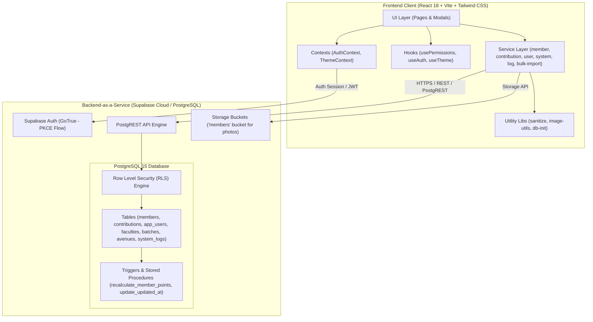
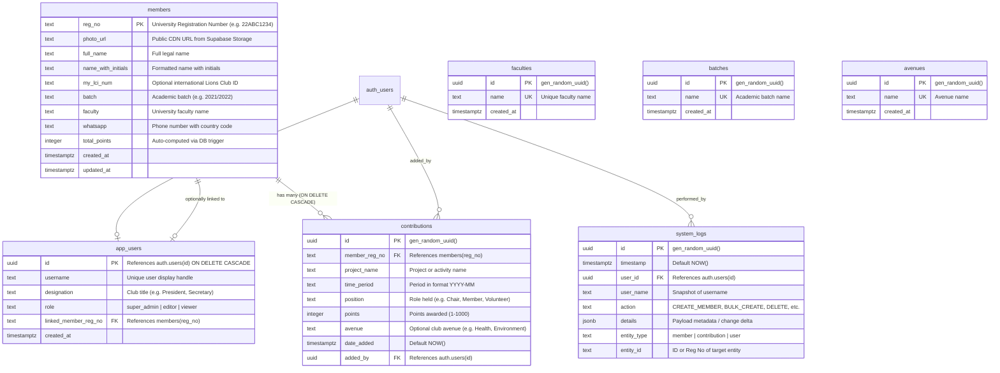

# SabraLeos KPI System — Comprehensive Architecture & Technical Specification

> **Target Audience**: AI Engineering Agents, Solutions Architects, and Software Developers.  
> **Purpose**: Serves as the complete, authoritative source of truth for the codebase, containing system architecture, data models, security policies, component breakdown, and a full feature catalog.

---

## 1. Executive Summary & Purpose

The **SabraLeos KPI System** (also known as **Nexus KPI**) is a specialized enterprise Progressive Web Application (PWA) engineered for the **Leo Club of Sabaragamuwa University of Sri Lanka** (District 306). 

The platform replaces legacy manual and spreadsheet-based workflows by digitizing:
- Member registration and profile management.
- Member service activity and contribution tracking.
- Automated real-time KPI point calculations and dynamic leaderboards (All-time and Month-by-month).
- Bulk project-based point distribution.
- Excel-based bulk member onboarding.
- Multi-criteria filtering, analytical reporting, and multi-format data exports (CSV & PDF).
- Fine-grained administrative controls, dynamic taxonomy management, and audit logging.

---

## 2. High-Level Architecture & Diagrams

### 2.1 System Architecture Diagram



---

### 2.2 Entity Relationship Diagram (ERD)



---

### 2.3 Application State & Navigation Flow

```mermaid
flowchart TD
    Start([App Mount]) --> CheckDB{Database Initialized?}
    CheckDB -- No --> SetupScreen[Show Database Setup Required Screen]
    CheckDB -- Yes --> CheckAuth{User Logged In?}

    CheckAuth -- No --> LoginScreen[Show LoginScreen]
    LoginScreen -->|Submit Credentials| AuthAttempt{Authenticate}
    AuthAttempt -- Success --> LoadProfile{Load app_users Profile}
    AuthAttempt -- 5 Failures --> Lockout[60s Rate-Limit Lockout]
    
    LoadProfile -- Profile Found --> MainApp[Render Main Application]
    LoadProfile -- Missing Profile --> AccountNotFound[Show AccountNotFound Diagnostic Screen]

    MainApp --> Nav[Navbar Navigation]
    Nav --> DashboardPage[Dashboard Page]
    Nav --> MembersPage[Members & Leaderboard Page]
    Nav --> ReportsPage[Reports & Analytics Page]
    Nav --> UserManagementPage[User Management Page (Super Admin Only)]
    
    MembersPage --> ViewProfile[Member Profile & Timeline View]
    MembersPage --> NewMemberModal[New Member Modal]
    MembersPage --> EditMemberModal[Edit Member Modal]
    MembersPage --> AddPointModal[Add Contribution Modal]
    MembersPage --> BulkImportModal[Excel Bulk Import Modal]
    MembersPage --> BulkProjectModal[Bulk Project Point Modal]

    UserManagementPage --> TabUsers[Tab 1: User Accounts]
    UserManagementPage --> TabSystem[Tab 2: System Data - Faculties/Batches/Avenues]
    UserManagementPage --> TabLogs[Tab 3: System Audit Logs]
```

---

## 3. Technology Stack & Dependencies

| Category | Technology | Version | Purpose / Notes |
| :--- | :--- | :--- | :--- |
| **Runtime & Bundler** | Vite | `^7.3.1` | Ultra-fast HMR, ES module bundling, tree shaking |
| **Language** | TypeScript | `^5.5.3` | Strict type safety across database models and API calls |
| **UI Framework** | React | `^18.3.1` | Component architecture, state hooks, functional components |
| **Styling** | Tailwind CSS | `^3.4.1` | Utility-first CSS, custom dark mode classes, glassmorphism design |
| **Icons** | Lucide React | `^0.344.0` | Modern, consistent icon library |
| **Backend & DB** | Supabase JS | `^2.57.4` | Client-side SDK for PostgREST, Auth (PKCE), and Storage |
| **PDF Generation** | jsPDF + AutoTable | `^4.2.0` / `^5.0.7` | High-fidelity branded report generation in vector PDF |
| **Excel Processing** | SheetJS (xlsx) | `^0.18.5` | Parsing and creating `.xlsx` templates and bulk uploads |
| **Testing** | Vitest + RTL | `^4.0.18` / `^16.3.2` | Fast unit and integration tests with JSDOM |

---

## 4. Project Directory Structure

```
Nexus_KPI/
├── public/                     # Static public assets
│   ├── images/                 # Brand images, Round_logo.png, pattern.png, side-mask.png
│   └── favicon.ico
├── src/
│   ├── components/             # Reusable UI components & modals
│   │   ├── AccountNotFound.tsx            # Diagnostic fallback when app_users row is missing
│   │   ├── AddContributionForm.tsx        # Single-member point entry form
│   │   ├── BulkImportModal.tsx            # Excel file upload and validation modal
│   │   ├── BulkProjectContributionForm.tsx# Multi-member project points assignment modal
│   │   ├── EditMemberForm.tsx             # Member profile edit modal
│   │   ├── ExportOptionsModal.tsx         # Column customizer and format selector (CSV/PDF)
│   │   ├── Layout.tsx                     # Layout wrapper
│   │   ├── LoginScreen.tsx                # Branded login form with lockout security
│   │   ├── Navbar.tsx                     # Top navigation bar, theme toggle, mobile drawer
│   │   ├── NewMemberForm.tsx              # Registration form with client-side photo processing
│   │   ├── SystemDataManagement.tsx       # CRUD for Faculties, Batches, and Avenues
│   │   └── SystemLogs.tsx                 # System audit log viewer with search/filtering
│   ├── contexts/               # Global React state providers
│   │   ├── AuthContext.tsx                # User session, appUser role, 15m idle timeout
│   │   └── ThemeContext.tsx               # Dark/Light theme toggle with localStorage persistence
│   ├── hooks/                  # Custom React hooks
│   │   ├── usePermissions.ts              # RBAC helper (canEdit, canManageUsers, isViewer, etc.)
│   │   └── __tests__/                     # Hook test suite
│   ├── lib/                    # Core configuration & utilities
│   │   ├── db-init.ts                     # Database health checker and mock data seeder
│   │   ├── image-utils.ts                 # Canvas-based photo compressor & CORS blob downloader
│   │   ├── sanitize.ts                    # PostgREST query escape, password strength, regex validations
│   │   ├── supabase.ts                    # Supabase client instantiation (sessionStorage configured)
│   │   └── __tests__/                     # Unit test suites (sanitize tests)
│   ├── pages/                  # Main routed page views
│   │   ├── Dashboard.tsx                  # Metrics overview, quick search, Top 3 podium
│   │   ├── Members.tsx                    # Search, All-Time/Monthly leaderboard, member timeline
│   │   ├── Reports.tsx                    # Multi-filter analytical reports and export triggers
│   │   └── UserManagement.tsx             # Super Admin control center (Users, System Data, Logs)
│   ├── services/               # Modular PostgREST API client services
│   │   ├── bulk-import-service.ts         # Excel parsing, validation, batch insertion
│   │   ├── contribution-service.ts        # Point contributions CRUD, monthly aggregations
│   │   ├── log-service.ts                 # Audit logging write and read operations
│   │   ├── member-service.ts              # Member CRUD, storage upload, full-text search
│   │   ├── system-service.ts              # Taxonomy CRUD (faculties, batches, avenues)
│   │   └── user-service.ts                # User creation, role update, password reset, delete
│   ├── types/
│   │   └── database.ts                    # TypeScript definitions matching DB schema
│   ├── App.tsx                 # Root component orchestrating page routing & DB check
│   ├── index.css               # Design tokens, custom scrollbars, glassmorphism utilities
│   ├── main.tsx                # React DOM mount point
│   └── test-setup.ts           # Vitest global setup
├── documentation/              # Legacy guides, deployment notes, and SQL setup files
├── supabase_schema.sql         # Production-ready SQL schema, triggers, and RLS policies
├── tailwind.config.js          # Custom theme extensions (maroon, gold, dark surfaces)
├── vite.config.ts              # Build config
└── wrangler.toml               # Cloudflare Pages deployment configuration
```

---

## 5. Database Schema, Triggers & Security (Supabase / Postgres)

### 5.1 Tables Definition
1. **`members`**: Primary registry for club members.
   - `reg_no` (TEXT PK): Normalized university student ID (e.g. `22ABC1234`).
   - `photo_url` (TEXT): Supabase Storage URL.
   - `full_name` (TEXT): Full legal name.
   - `name_with_initials` (TEXT): Display name.
   - `my_lci_num` (TEXT, Nullable): Lions Club International Member Number.
   - `batch` (TEXT): Academic batch reference.
   - `faculty` (TEXT): Academic faculty reference.
   - `whatsapp` (TEXT): WhatsApp contact number.
   - `total_points` (INTEGER, Default 0): Accumulated points, automatically managed via trigger.
   - `created_at`, `updated_at` (TIMESTAMPTZ).

2. **`contributions`**: Individual service records earning points.
   - `id` (UUID PK): Auto-generated.
   - `member_reg_no` (TEXT FK -> `members.reg_no` ON DELETE CASCADE).
   - `project_name` (TEXT): Title of the event or activity.
   - `time_period` (TEXT): Format `YYYY-MM` (used for monthly leaderboard aggregations).
   - `position` (TEXT): Role performed (e.g., "Project Chair", "Committee Member").
   - `points` (INTEGER): Points earned (strictly 1 to 1000).
   - `avenue` (TEXT, Nullable): Activity avenue.
   - `date_added` (TIMESTAMPTZ): Entry timestamp.
   - `added_by` (UUID FK -> `auth.users(id)` ON DELETE SET NULL).

3. **`app_users`**: Application user profile linking authentication identities to roles.
   - `id` (UUID PK -> `auth.users(id)` ON DELETE CASCADE).
   - `username` (TEXT Unique): Display name.
   - `designation` (TEXT): Position in club leadership.
   - `role` (TEXT): `'super_admin' | 'editor' | 'viewer'`.
   - `linked_member_reg_no` (TEXT FK -> `members.reg_no`, Nullable).
   - `created_at` (TIMESTAMPTZ).

4. **Taxonomy Tables**: `faculties`, `batches`, `avenues`.
   - Each contains `id` (UUID PK), `name` (TEXT Unique), `created_at` (TIMESTAMPTZ).

5. **`system_logs`**: System audit trail.
   - `id` (UUID PK), `timestamp` (TIMESTAMPTZ), `user_id` (UUID), `user_name` (TEXT), `action` (TEXT), `details` (JSONB), `entity_type` (TEXT), `entity_id` (TEXT).

---

### 5.2 PostgreSQL Triggers & Stored Procedures

#### Dynamic Point Recalculation Trigger
A database-level trigger ensures data integrity: whenever a row in `contributions` is inserted, updated, or deleted, `total_points` in `members` is recalculated from the sum of all contributions.
```sql
CREATE OR REPLACE FUNCTION public.recalculate_member_points()
RETURNS TRIGGER LANGUAGE plpgsql SECURITY DEFINER AS $$
DECLARE 
    target_reg_no TEXT;
BEGIN
    IF TG_OP = 'DELETE' THEN 
        target_reg_no := OLD.member_reg_no;
    ELSE 
        target_reg_no := NEW.member_reg_no; 
    END IF;

    UPDATE public.members
    SET total_points = COALESCE((SELECT SUM(points) FROM public.contributions WHERE member_reg_no = target_reg_no), 0),
        updated_at = NOW()
    WHERE reg_no = target_reg_no;

    RETURN COALESCE(NEW, OLD);
END; 
$$;

CREATE TRIGGER trg_recalculate_points
  AFTER INSERT OR UPDATE OR DELETE ON public.contributions
  FOR EACH ROW EXECUTE FUNCTION public.recalculate_member_points();
```

#### Helper Security Function
To avoid infinite recursion in RLS policies, a helper function reads the current authenticated user's role:
```sql
CREATE OR REPLACE FUNCTION public.get_my_role()
RETURNS TEXT LANGUAGE sql STABLE SECURITY DEFINER AS $$
  SELECT role::text FROM public.app_users WHERE id = auth.uid();
$$;
```

---

### 5.3 Row Level Security (RLS) Policy Matrix

| Table | SELECT | INSERT | UPDATE | DELETE |
| :--- | :--- | :--- | :--- | :--- |
| **`members`** | All authenticated | `super_admin`, `editor` | `super_admin`, `editor` | `super_admin`, `editor` |
| **`contributions`** | All authenticated | `super_admin`, `editor` | `super_admin` OR (`editor` AND `added_by = auth.uid()`) | `super_admin` only |
| **`app_users`** | All authenticated | `super_admin` only | `super_admin` OR `id = auth.uid()` | `super_admin` only |
| **`faculties`** | All authenticated | `super_admin`, `editor` | `super_admin`, `editor` | `super_admin`, `editor` |
| **`batches`** | All authenticated | `super_admin`, `editor` | `super_admin`, `editor` | `super_admin`, `editor` |
| **`avenues`** | All authenticated | `super_admin`, `editor` | `super_admin`, `editor` | `super_admin`, `editor` |
| **`system_logs`** | `super_admin`, `editor` | Authenticated (Any) | Denied | Denied |
| **`storage.objects` (`members` bucket)** | Public (Anyone) | `super_admin`, `editor` | `super_admin`, `editor` | `super_admin` only |

---

## 6. Authentication, Session & Access Control

### 6.1 Authentication Architecture
- **Supabase GoTrue (PKCE Flow)**: Authenticates users using email/username and password.
- **Session Isolation**: Configured with `storage: window.sessionStorage`. If the user closes the browser or tab, session tokens are immediately invalidated (mitigates shared device vulnerabilities). On startup, legacy `localStorage` keys matching `sb-*` are proactively scrubbed.
- **15-Minute Inactivity Auto-Logout**: Global window listeners (`mousedown`, `keydown`, `scroll`, `touchstart`) reset a 15-minute timer. If no user interaction occurs for 15 minutes, `signOut()` triggers automatically.
- **Brute-Force Rate Limiting**: The `LoginScreen` component tracks consecutive invalid credentials. After 5 failed attempts, the interface enters a locked state for 60 seconds with an active countdown timer.
- **Missing Profile Safety Screen (`AccountNotFound`)**: If an authentication record exists in `auth.users` but no corresponding profile row exists in `app_users` (or RLS prevents access), the app displays a diagnostic screen detailing the user ID, error reason, and SQL fix snippet.

---

### 6.2 Role-Based Access Control (RBAC) Specification

| Capability / Action | `super_admin` | `editor` | `viewer` |
| :--- | :---: | :---: | :---: |
| View Dashboard & Metrics | Yes | Yes | Yes |
| Lookup Members & View Profiles | Yes | Yes | Yes |
| View All-Time & Monthly Leaderboards | Yes | Yes | Yes |
| View & Filter Reports | Yes | Yes | Yes |
| Export Data (CSV & PDF) | Yes | Yes | Yes |
| Download Member Photos | Yes | Yes | Yes |
| Register New Members | Yes | Yes | No |
| Edit Member Details & Photo | Yes | Yes | No |
| Add Single Member Contribution | Yes | Yes | No |
| Add Bulk Project Contributions | Yes | Yes | No |
| Import Members via Excel (.xlsx) | Yes | Yes | No |
| Delete Members (Completely) | Yes | Yes | No |
| Delete / Update Existing Contributions | Yes (Any) | Yes (Own only) | No |
| Manage System Data (Faculties, Batches, Avenues) | Yes | Yes | No |
| View System Audit Logs | Yes | Yes | No |
| Access User Management Page | Yes | No | No |
| Create New System User Accounts | Yes | No | No |
| Change User Roles & Designations | Yes | No | No |
| Delete User Accounts | Yes (Protected) | No | No |

---

## 7. Exhaustive Feature Catalog

### 7.1 Dashboard (`src/pages/Dashboard.tsx`)
- **Metric Cards**:
  - *Total Service Points*: Dynamic sum of all member points in system.
  - *Projects This Month*: Count of distinct projects registered within the current calendar month.
  - *Active Members*: Total count of registered members.
- **Quick Member Lookup**: Search bar accepting registration numbers; immediately redirects to the Member Profile view with search query populated.
- **Quick Action ("Add Contribution")**: Opens Member page in contribution mode.
- **Podium Leaderboard**: Displays Top 3 contributors with gold, silver, and bronze gradient badges, member avatars, registration numbers, faculties, and point totals.

---

### 7.2 Member Management & Leaderboard (`src/pages/Members.tsx`)

#### A. Dual-Mode Leaderboard
1. **All-Time Leaderboard**: Ranks all members by `total_points` descending.
2. **Monthly Leaderboard**:
   - Includes a Month Picker (`<input type="month" />`).
   - Uses `contributionService.getMonthlyLeaderboard(year, month)` to aggregate points registered within the matching `time_period` (`YYYY-MM`).
   - Displays members ranked by points accumulated within that specific calendar month.

#### B. Multi-Factor Filtering
- Filter by **Faculty** (dynamically loaded from `faculties` table).
- Filter by **Academic Batch** (dynamically loaded from `batches` table).
- Combined filters with single-click "Clear" button.

#### C. Search & Member Profile Dossier
- Instant search by:
  - University Registration Number (case-insensitive substring/prefix).
  - Full Name.
  - Name with Initials.
- **Detailed Profile Card**:
  - Member Avatar with hover-to-download action (`downloadImage`).
  - Initials fallback placeholder if photo is missing or fails to load.
  - Full name, initials, registration number, academic batch, faculty, and WhatsApp number.
  - Service points counter badge.
  - **Contribution Timeline**: Chronological history of all projects, positions, avenues, points awarded (`+X points`), and date added.

#### D. Member CRUD Operations
- **Register New Member** (`NewMemberForm.tsx`):
  - Form validation: Reg No (>= 3 chars), full name, initials, batch select, faculty select, phone regex.
  - Photo upload: validates file type (JPEG, PNG, WebP) and size (< 5MB), resizes and compresses client-side to JPEG (max 1024x1024, quality 0.8) before uploading to Supabase Storage.
- **Edit Member** (`EditMemberForm.tsx`): Update member details and replace or remove photo.
- **Delete Member**: Performs cascade cleanup (removes member contributions and member record completely) and records an audit log.

---

### 7.3 Bulk Operations Engine

#### A. Excel Member Bulk Import (`BulkImportModal.tsx`, `bulk-import-service.ts`)
- **Downloadable Template**: Generates a standard Excel template (`member_import_template.xlsx`) prefilled with valid batches and faculties.
- **Client-Side Parsing & Validation**: Uses SheetJS (`xlsx`) to parse uploaded files.
  - Validates mandatory fields: `reg_no`, `full_name`, `name_with_initials`, `batch`, `faculty`, `whatsapp`.
  - Checks for duplicates against database records before inserting.
- **Results Reporting**: Real-time modal summary displaying total successful imports, count of failed rows, and error reasons per row.

#### B. Bulk Project Contribution Assignment (`BulkProjectContributionForm.tsx`)
- Facilitates assigning points to multiple members participating in the same project simultaneously.
- **Project Scope**: Project Name, Time Period (`YYYY-MM`), Avenue select, Default Position, Default Points.
- **Interactive Member Search & Selection**: Live autocomplete search; click to add member to the project roster.
- **Per-Member Overrides**: Customize the position and point value individually for each participant in the roster.
- **Batch Insertion**: Inserts all contributions in a single database transaction via `contributionService.createMany()`.

---

### 7.4 Reports & Data Export (`src/pages/Reports.tsx`)

#### A. Multi-Criteria Analytics
- Filter contributions by:
  - Date Range (Start Date and End Date based on contribution `date_added`).
  - Minimum Project Count (filters members who participated in at least $N$ unique projects).
  - Faculty breakdown.
- Displays live member report table with dynamic calculation of project counts and point totals matching the filter criteria.

#### B. Advanced Export Modal (`ExportOptionsModal.tsx`)
- **Format Toggle**: Export as **CSV** or **PDF**.
- **Column Customizer**: Checkbox selection for fields:
  - Registration Number
  - Name with Initials
  - Faculty
  - Academic Batch
  - Total Points
  - Project Count
  - WhatsApp
- **PDF Engine**: Uses `jspdf` and `jspdf-autotable` to format a vector PDF with:
  - Official maroon header color scheme.
  - Generated timestamp and active filter summary metadata.
  - Alternating row styling.

---

### 7.5 Administration & Security (`src/pages/UserManagement.tsx`)

Restricted exclusively to `super_admin` users, organized into three functional tabs:

#### Tab 1: User Accounts Management
- Table of all application accounts (`app_users`), showing username, designation, role badge, and linked member profile.
- **Create User**: Uses an isolated secondary Supabase client to trigger `auth.signUp` without logging out the active admin session, inserting the profile row into `app_users`.
- **Edit User**: Modify username, designation, role, and linked member registration number.
- **Reset Password**: Sends password recovery email via Supabase Auth.
- **Delete User**: Deletes user profile from `app_users` with safety check preventing deletion of the last remaining `super_admin`.

#### Tab 2: System Data Management (`SystemDataManagement.tsx`)
- Dynamic CRUD operations for university taxonomy:
  - **Faculties**: Add, rename, or delete faculties.
  - **Academic Batches**: Add, rename, or delete academic batches.
  - **Club Avenues**: Add, rename, or delete avenues.

#### Tab 3: System Audit Logs (`SystemLogs.tsx`)
- Live audit log viewer consuming `system_logs`.
- Records:
  - User logins (`LOGIN`)
  - Member creation, update, and deletion (`CREATE_MEMBER`, `UPDATE_MEMBER`, `DELETE_MEMBER`)
  - Point awards and bulk awards (`CREATE_CONTRIBUTION`, `BULK_CREATE_CONTRIBUTIONS`, `DELETE_CONTRIBUTION`)
- Real-time search bar filtering across user names, actions, or entity IDs.
- Color-coded badges highlighting create, edit, delete, and login actions.

---

## 8. Client Utility Modules & Security Guards

### 8.1 Sanitization & Security (`src/lib/sanitize.ts`)
- **`sanitizeSearchQuery(query)`**: Removes characters (`[,.()*%\\']`) that could break or manipulate PostgREST `.or()` filter syntax, escaping single quotes and enforcing a 100-character cap.
- **`validatePassword(password)`**: Enforces strict password complexity: minimum 8 characters, at least 1 uppercase letter, 1 lowercase letter, 1 number, and 1 special character; calculates password strength score.
- **`sanitizeTextInput(input)`**: Strips HTML tags (`<[^>]*>`) to prevent stored XSS attacks.
- **`validatePhotoFile(file)`**: Validates MIME types (`image/jpeg`, `image/png`, `image/webp`, `image/gif`) and enforces 5MB limit.
- **`validatePoints(points)`**: Enforces positive integer constraint between 1 and 1000.

### 8.2 Image Optimization & Download (`src/lib/image-utils.ts`)
- **`optimizeImage(file, { maxWidth, maxHeight, quality })`**:
  - Uses an off-screen HTML5 `<canvas>`.
  - Calculates proportional aspect ratio downscaling (default max 1024x1024 or 800x800).
  - Encodes compressed output as `image/jpeg` with 0.8 quality.
  - Pre-binds event listeners before `FileReader` execution to avoid browser cache race conditions.
- **`downloadImage(url, filename)`**:
  - Performs a CORS `fetch` to retrieve the image blob and programmatically triggers a browser download.
  - Gracefully falls back to opening in a new tab if cross-origin policy denies direct blob download.

---

## 9. Environment Variables & Deployment

### Required Environment Variables (`.env`)
```bash
# Supabase Configuration
VITE_SUPABASE_URL=https://your-supabase-project.supabase.co
VITE_SUPABASE_ANON_KEY=your-anon-public-key
```

### Production Build & Deployment Commands
```bash
# Run local development server (Vite)
npm run dev

# Run TypeScript type check
npm run typecheck

# Run ESLint validation
npm run lint

# Run Unit & Integration Tests (Vitest)
npm run test

# Compile production bundle into dist/
npm run build
```

---

## 10. Key Architecture Decisions & Known Quirks for Future Developers

1. **Session Storage Decision**:
   - `supabase.ts` uses `window.sessionStorage` rather than `localStorage`.
   - *Rationale*: Members and club officers frequently use public, university-owned, or shared devices. Session-based tokens guarantee automatic termination when browser tabs close.
2. **PostgreSQL Trigger vs Client Recalculation**:
   - Member point totals are never calculated by adding numbers in frontend code.
   - The PostgreSQL `trg_recalculate_points` trigger is the sole source of truth for `members.total_points`.
3. **User Deletion Nuance (`app_users` vs `auth.users`)**:
   - The frontend `userService.delete(id)` deletes the `public.app_users` row.
   - Due to Supabase security restrictions, deleting the underlying `auth.users` record requires a Supabase Service Role Key (Backend Edge Function) or deletion via the Supabase Admin Dashboard. Refer to `documentation/USER_DELETION_GUIDE.md`.
4. **Supabase Storage Bucket Configuration**:
   - The `members` storage bucket must have **Public Bucket** enabled in Supabase Storage settings for public photo read access (`getPublicUrl`), while upload/delete operations are protected by RLS on `storage.objects`.
5. **No URL-based Routing Engine**:
   - Navigation between `dashboard`, `members`, `reports`, and `users` is orchestrated via state in `App.tsx` (`currentPage`, `pageData`).
   - *Consideration for future AI*: If introducing deep linking or browser back-button history, migrate to `react-router-dom` or TanStack Router.
