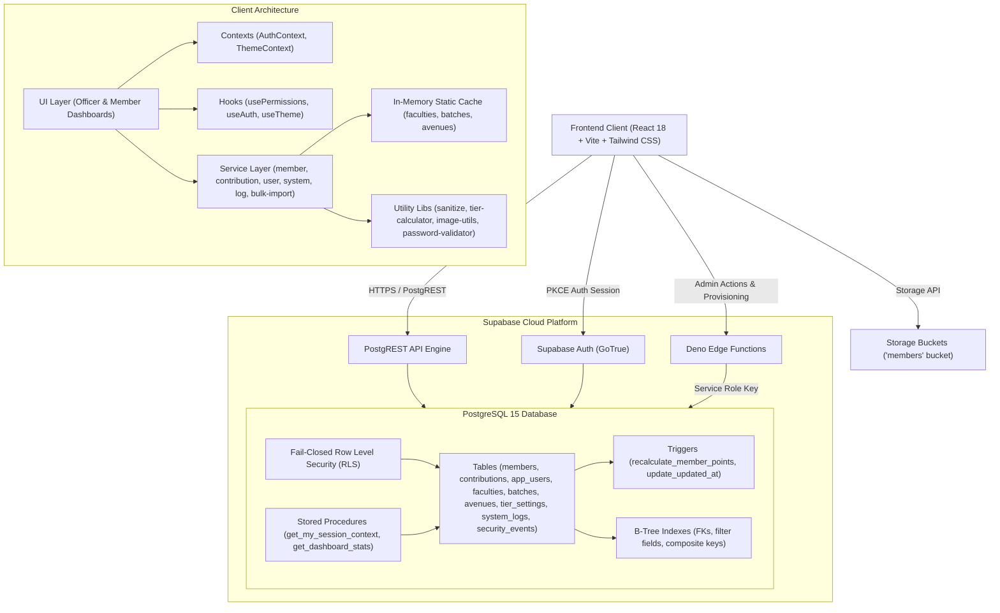

# SabraLeos KPI System — Comprehensive Architecture & Technical Specification

> **Target Audience**: AI Engineering Agents, Solutions Architects, and Software Developers.  
> **Purpose**: Serves as the complete, authoritative source of truth for the codebase, containing system architecture, data models, security policies, component breakdown, and a full feature catalog.

---

## 1. Executive Summary & Purpose

The **SabraLeos KPI System** (also known as **Nexus KPI**) is a specialized enterprise Progressive Web Application (PWA) engineered for the **Leo Club of Sabaragamuwa University of Sri Lanka** (District 306). 

The platform replaces legacy manual and spreadsheet-based workflows by digitizing:
- Member registration and profile management.
- Member service activity and contribution tracking.
- Automated real-time KPI point calculations and dynamic leaderboards (All-time and Month-by-month).
- Bulk project-based point distribution.
- Excel-based bulk member onboarding.
- Multi-criteria filtering, analytical reporting, and multi-format data exports (CSV & PDF).
- Fine-grained administrative controls, dynamic taxonomy management, and audit logging.

---

## 2. High-Level Architecture & Diagrams

### 2.1 System Architecture Diagram



---

### 2.2 Entity Relationship Diagram (ERD)

```mermaid
erDiagram
    auth_users ||--o| app_users : "1:1 identity"
    members ||--o{ contributions : "has many (ON DELETE CASCADE)"
    members ||--o| app_users : "optionally linked to"
    auth_users ||--o{ contributions : "added_by"
    auth_users ||--o{ system_logs : "user_id"
    auth_users ||--o{ security_events : "actor_id"

    members {
        text reg_no PK "University Registration Number (e.g. 22ABC1234)"
        text photo_url "Public CDN URL from Supabase Storage"
        text full_name "Full legal name"
        text name_with_initials "Formatted name with initials"
        text my_lci_num "Optional international Lions Club ID"
        text batch "Academic batch (e.g. 2021/2022)"
        text faculty "University faculty name"
        text whatsapp "Phone number with country code"
        integer total_points "Auto-computed via DB trigger"
        timestamptz created_at
        timestamptz updated_at
    }

    contributions {
        uuid id PK "gen_random_uuid()"
        text member_reg_no FK "References members(reg_no)"
        text project_name "Project or activity name"
        text time_period "Period in format YYYY-MM"
        text position "Role held (e.g. Chair, Member, Volunteer)"
        integer points "Points awarded (1-1000)"
        text avenue "Optional club avenue (e.g. Health, Environment)"
        timestamptz date_added "Default NOW()"
        uuid added_by FK "References auth.users(id)"
    }

    app_users {
        uuid id PK "References auth.users(id) ON DELETE CASCADE"
        text username "Unique user display handle"
        text designation "Club title (e.g. President, Secretary)"
        text role "super_admin | admin | editor | viewer | member"
        text status "active | suspended"
        text linked_member_reg_no FK "References members(reg_no)"
        timestamptz created_at
    }

    tier_settings {
        text id PK "bronze | silver | gold | platinum | diamond"
        text name "Tier display name"
        integer min_points "Minimum points threshold"
        text color "Hex brand color"
        text badge_style "CSS badge styling token"
        integer sort_order "Sort sequence"
        timestamptz updated_at
    }

    faculties {
        uuid id PK "gen_random_uuid()"
        text name UK "Unique faculty name"
        timestamptz created_at
    }

    batches {
        uuid id PK "gen_random_uuid()"
        text name UK "Academic batch name"
        timestamptz created_at
    }

    avenues {
        uuid id PK "gen_random_uuid()"
        text name UK "Avenue name"
        timestamptz created_at
    }

    system_logs {
        uuid id PK "gen_random_uuid()"
        timestamptz created_at "Default NOW()"
        timestamptz timestamp "Legacy compatibility"
        uuid user_id FK "References auth.users(id)"
        text actor_name "Resolved display handle or email"
        text user_name "Snapshot of username"
        text action "CREATE_MEMBER, BULK_CREATE, DELETE, etc."
        text entity_type "member | contribution | user | tier_settings"
        text entity_id "Target entity ID or Reg No"
        jsonb details "Payload metadata / change delta"
    }

    security_events {
        uuid id PK "gen_random_uuid()"
        timestamptz created_at "Default NOW()"
        text event_type "LOGIN_SUCCESS | LOGIN_FAILED | LOGOUT | LOCKOUT"
        text severity "INFO | WARN | CRITICAL"
        uuid actor_id FK "References auth.users(id)"
        text actor_email "Associated actor email"
        text actor_name "Resolved actor name"
        jsonb details "Context / client metadata"
    }
```



---

### 2.3 Application State & Navigation Flow

```mermaid
flowchart TD
    Start([App Mount]) --> CheckDB{Database Initialized?}
    CheckDB -- No --> SetupScreen[Show Database Setup Required Screen]
    CheckDB -- Yes --> CheckAuth{User Logged In?}

    CheckAuth -- No --> AuthRoutes{Auth Route}
    AuthRoutes --> LoginScreen[Show LoginScreen]
    AuthRoutes --> ForgotPass[Show ForgotPassword Screen]
    AuthRoutes --> SetPass[Show SetPassword Screen]
    
    LoginScreen -->|Submit Credentials| AuthAttempt{Authenticate}
    AuthAttempt -- Success --> LoadProfile{Load Session Context via RPC}
    AuthAttempt -- 5 Failures --> Lockout[60s Rate-Limit Lockout]
    
    LoadProfile -- Missing Profile --> AccountNotFound[Show AccountNotFound Screen]
    LoadProfile -- Profile Suspended --> TerminateSession[Auto Sign Out]
    LoadProfile -- Profile Found --> RouteByUserRole{User Role?}

    RouteByUserRole -- member --> MemberPortal[Render Dedicated Member Dashboard]
    RouteByUserRole -- super_admin / admin / editor / viewer --> MainApp[Render Officer Portal]

    MainApp --> Nav[Navbar Navigation]
    Nav --> OfficerDashboardPage[Officer Dashboard Page]
    Nav --> MembersPage[Members Directory & Leaderboards]
    Nav --> ReportsPage[Reports & Analytics Page]
    Nav --> UserManagementPage[User Management Center (Super Admin & Admin Only)]

    UserManagementPage --> TabUsers[Tab 1: User Accounts]
    UserManagementPage --> TabProvision[Tab 2: Provision Members via Edge Function]
    UserManagementPage --> TabSystem[Tab 3: System Data - Faculties/Batches/Avenues]
    UserManagementPage --> TabTiers[Tab 4: Tier Settings Management]
    UserManagementPage --> TabLogs[Tab 5: System & Security Audit Logs]
```

---

## 3. Technology Stack & Dependencies

| Category | Technology | Version | Purpose / Notes |
| :--- | :--- | :--- | :--- |
| **Runtime & Bundler** | Vite | `^7.3.1` | Ultra-fast HMR, ES module bundling, tree shaking |
| **Language** | TypeScript | `^5.5.3` | Strict type safety across database models and API calls |
| **UI Framework** | React | `^18.3.1` | Component architecture, state hooks, lazy loaded route chunks |
| **Styling** | Tailwind CSS | `^3.4.1` | Utility-first CSS, custom dark mode classes, glassmorphism design |
| **Icons** | Lucide React | `^0.344.0` | Modern, consistent icon library |
| **Backend & DB** | Supabase JS | `^2.57.4` | Client-side SDK for PostgREST, Auth (PKCE), Storage, and RPCs |
| **Serverless API** | Deno Edge Functions | `^1.0.0` | Admin user creation, password management, bulk provisioning |
| **PDF Generation** | jsPDF + AutoTable | `^4.2.0` / `^5.0.7` | Dynamic on-demand loaded branded vector PDF generation |
| **Excel Processing** | SheetJS (xlsx) | `^0.18.5` | Dynamic on-demand loaded `.xlsx` bulk parsing and template creation |
| **Security Scoring** | zxcvbn | `^4.4.2` | Entropy-based client-side password strength validation |
| **Validation** | Zod | `^4.6.5` | Type inference and runtime schema validation |
| **Testing** | Vitest + RTL | `^4.0.18` / `^16.3.2` | Fast unit and integration tests with JSDOM |

---

## 4. Project Directory Structure

```
Nexus_KPI/
├── public/                     # Static public assets
│   ├── images/                 # Brand images, Round_logo.png, pattern.png, side-mask.png
│   └── favicon.ico
├── src/
│   ├── components/             # Reusable UI components & modals
│   │   ├── AccountNotFound.tsx            # Diagnostic fallback when app_users row is missing
│   │   ├── AddContributionForm.tsx        # Single-member point entry form
│   │   ├── BulkImportModal.tsx            # Excel file upload and validation modal
│   │   ├── BulkProjectContributionForm.tsx# Multi-member project points assignment modal
│   │   ├── ChangePasswordModal.tsx        # In-app password change modal with strength meter
│   │   ├── ChunkErrorBoundary.tsx         # Network chunk retry error boundary for lazy routes
│   │   ├── EditMemberForm.tsx             # Member profile edit modal
│   │   ├── ExportOptionsModal.tsx         # Column customizer and format selector (CSV/PDF)
│   │   ├── Layout.tsx                     # Layout wrapper
│   │   ├── LoginScreen.tsx                # Branded login form with lockout security
│   │   ├── MemberDashboard.tsx            # Dedicated member portal view with tier & stats
│   │   ├── Navbar.tsx                     # Top navigation bar, theme toggle, mobile drawer
│   │   ├── NewMemberForm.tsx              # Registration form with client-side photo processing
│   │   ├── PageSkeleton.tsx               # Animated route transition skeleton loader
│   │   ├── SystemDataManagement.tsx       # CRUD for Faculties, Batches, and Avenues
│   │   ├── SystemLogs.tsx                 # System audit & security log viewer
│   │   ├── TierBadge.tsx                  # Visual tier badges (Bronze -> Diamond)
│   │   ├── TierOverviewCard.tsx           # Member tier summary widget
│   │   ├── TierProgressBar.tsx            # Visual progress bar towards next tier threshold
│   │   └── TierSettingsManagement.tsx     # Admin panel for tier threshold configuration
│   ├── contexts/               # Global React state providers
│   │   ├── AuthContext.tsx                # User session, RPC hydration, 15m idle timeout
│   │   └── ThemeContext.tsx               # Dark/Light theme toggle with localStorage persistence
│   ├── hooks/                  # Custom React hooks
│   │   ├── usePermissions.ts              # RBAC helper (canEdit, canManageUsers, isOfficer, isMember)
│   │   └── __tests__/                     # Hook test suite
│   ├── lib/                    # Core configuration & utilities
│   │   ├── db-init.ts                     # Database health checker and mock data seeder
│   │   ├── image-utils.ts                 # Canvas-based photo compressor & CORS blob downloader
│   │   ├── password-validator.ts          # Zxcvbn password policy enforcement
│   │   ├── sanitize.ts                    # PostgREST query escape, input sanitization, regex validations
│   │   ├── supabase.ts                    # Supabase client instantiation (sessionStorage configured)
│   │   ├── tier-calculator.ts             # Club tier calculation rules & default config
│   │   └── __tests__/                     # Unit test suites
│   ├── pages/                  # Routed page views
│   │   ├── Dashboard.tsx                  # Route switch (OfficerDashboard vs MemberDashboard)
│   │   ├── OfficerDashboard.tsx           # Metrics overview, quick search, Top 3 podium
│   │   ├── Members.tsx                    # Search, All-Time/Monthly leaderboard, member timeline
│   │   ├── Reports.tsx                    # Multi-filter analytical reports and export triggers
│   │   ├── UserManagement.tsx             # 5-tab admin center (Users, Provision, Data, Tiers, Logs)
│   │   ├── ForgotPassword.tsx             # Self-service password recovery request view
│   │   └── SetPassword.tsx                # Tokenized password setup view
│   ├── services/               # Modular PostgREST API client services
│   │   ├── bulk-import-service.ts         # Excel parsing, validation, 100-item chunk batching
│   │   ├── contribution-service.ts        # Point contributions CRUD, monthly aggregations
│   │   ├── log-service.ts                 # Audit and security logging with actor resolution
│   │   ├── member-service.ts              # Member CRUD, storage upload, full-text search
│   │   ├── system-service.ts              # Taxonomy CRUD, tier settings, in-memory cache
│   │   └── user-service.ts                # User management & Edge Functions client
│   ├── types/
│   │   └── database.ts                    # TypeScript definitions matching DB schema
│   ├── App.tsx                 # Root component orchestrating page routing, code splitting & DB check
│   ├── index.css               # Design tokens, custom scrollbars, glassmorphism utilities
│   ├── main.tsx                # React DOM mount point
│   └── test-setup.ts           # Vitest global setup
├── supabase/
│   ├── functions/              # Deno Edge Functions
│   │   ├── admin-change-user-email/       # Updates email in auth
│   │   ├── admin-create-user/             # Creates user with auth credentials
│   │   ├── admin-delete-user/             # Deletes user from auth & public schema
│   │   ├── admin-reset-mfa/               # Resets MFA factors
│   │   ├── admin-send-password-reset/     # Sends recovery email
│   │   ├── admin-set-user-password/       # Administrative password override
│   │   ├── admin-set-user-status/         # Toggles active/suspended
│   │   └── provision-members/             # Bulk provisions members as users
│   └── migrations/             # Versioned SQL migrations
├── documentation/              # Architecture guides, schema references, and operations runbooks
├── tailwind.config.js          # Custom theme extensions (maroon, gold, dark surfaces)
├── vite.config.ts              # Build config
└── wrangler.toml               # Cloudflare Pages deployment configuration
```

---


## 5. Database Schema, Triggers & Security (Supabase / Postgres)

### 5.1 Tables Definition
1. **`members`**: Primary registry for club members.
   - `reg_no` (TEXT PK): Normalized university student ID (e.g. `22ABC1234`).
   - `photo_url` (TEXT, Nullable): Supabase Storage URL in `members` bucket.
   - `full_name` (TEXT): Full legal name.
   - `name_with_initials` (TEXT): Display name.
   - `my_lci_num` (TEXT, Nullable): Lions Club International Member Number.
   - `batch` (TEXT): Academic batch reference.
   - `faculty` (TEXT): Academic faculty reference.
   - `whatsapp` (TEXT): WhatsApp contact number.
   - `total_points` (INTEGER, Default 0): Accumulated points, automatically managed via trigger.
   - `created_at`, `updated_at` (TIMESTAMPTZ).

2. **`contributions`**: Individual service records earning points.
   - `id` (UUID PK): Auto-generated (`gen_random_uuid()`).
   - `member_reg_no` (TEXT FK -> `members.reg_no` ON DELETE CASCADE).
   - `project_name` (TEXT): Title of the event or activity.
   - `time_period` (TEXT): Format `YYYY-MM` (used for monthly leaderboard aggregations).
   - `position` (TEXT): Role performed (e.g., "Project Chair", "Volunteer").
   - `points` (INTEGER): Points earned (strictly 1 to 1000).
   - `avenue` (TEXT, Nullable): Activity avenue.
   - `date_added` (TIMESTAMPTZ): Entry timestamp.
   - `added_by` (UUID FK -> `auth.users(id)` ON DELETE SET NULL).

3. **`app_users`**: Application user profiles linking authentication identities to authorization roles.
   - `id` (UUID PK -> `auth.users(id)` ON DELETE CASCADE).
   - `username` (TEXT Unique): Display handle.
   - `designation` (TEXT): Position in club leadership or membership status.
   - `role` (TEXT): `'super_admin' | 'admin' | 'editor' | 'viewer' | 'member'`.
   - `status` (TEXT): `'active' | 'suspended'`.
   - `linked_member_reg_no` (TEXT FK -> `members.reg_no`, Nullable).
   - `created_at` (TIMESTAMPTZ).

4. **`tier_settings`**: Recognition tier configuration.
   - `id` (TEXT PK): `'bronze' | 'silver' | 'gold' | 'platinum' | 'diamond'`.
   - `name` (TEXT): Human-readable label.
   - `min_points` (INTEGER): Point threshold.
   - `color` (TEXT): Hex brand color.
   - `badge_style` (TEXT): CSS badge token.
   - `sort_order` (INTEGER): Display sequence order.
   - `updated_at` (TIMESTAMPTZ).

5. **Taxonomy Tables**: `faculties`, `batches`, `avenues`.
   - Each contains `id` (UUID PK), `name` (TEXT Unique), `created_at` (TIMESTAMPTZ).

6. **`system_logs`**: System audit trail.
   - `id` (UUID PK), `created_at` / `timestamp` (TIMESTAMPTZ), `user_id` (UUID), `actor_name` (TEXT), `user_name` (TEXT), `action` (TEXT), `details` (JSONB), `entity_type` (TEXT), `entity_id` (TEXT).

7. **`security_events`**: Authentication & security telemetry.
   - `id` (UUID PK), `created_at` (TIMESTAMPTZ), `event_type` (TEXT), `severity` (`INFO | WARN | CRITICAL`), `actor_id` (UUID), `actor_email` (TEXT), `actor_name` (TEXT), `details` (JSONB).

---

### 5.2 PostgreSQL Triggers & Stored Procedures

#### Dynamic Point Recalculation Trigger
A database-level trigger ensures data integrity: whenever a row in `contributions` is inserted, updated, or deleted, `total_points` in `members` is recalculated from the sum of all contributions.
```sql
CREATE OR REPLACE FUNCTION public.recalculate_member_points()
RETURNS TRIGGER LANGUAGE plpgsql SECURITY DEFINER AS $$
DECLARE 
    target_reg_no TEXT;
BEGIN
    IF TG_OP = 'DELETE' THEN 
        target_reg_no := OLD.member_reg_no;
    ELSE 
        target_reg_no := NEW.member_reg_no; 
    END IF;

    UPDATE public.members
    SET total_points = COALESCE((SELECT SUM(points) FROM public.contributions WHERE member_reg_no = target_reg_no), 0),
        updated_at = NOW()
    WHERE reg_no = target_reg_no;

    RETURN COALESCE(NEW, OLD);
END; 
$$;

CREATE TRIGGER trg_recalculate_points
  AFTER INSERT OR UPDATE OR DELETE ON public.contributions
  FOR EACH ROW EXECUTE FUNCTION public.recalculate_member_points();
```

#### Helper Security Functions & Stored Procedures (RPCs)
To prevent recursive RLS evaluation, optimize session bootstrap, and aggregate dashboard metrics in single round-trips:

```sql
-- Fast role lookup (SECURITY DEFINER, STABLE)
CREATE OR REPLACE FUNCTION public.get_my_role()
RETURNS TEXT LANGUAGE sql STABLE SECURITY DEFINER AS $$
  SELECT role::text FROM public.app_users WHERE id = auth.uid() AND is_active = true;
$$;

-- Officer privilege check: super_admin, admin, or editor
CREATE OR REPLACE FUNCTION public.is_officer()
RETURNS boolean LANGUAGE sql STABLE SECURITY DEFINER AS $$
  SELECT EXISTS (
    SELECT 1 FROM public.app_users 
    WHERE id = auth.uid() AND is_active = true AND role IN ('super_admin', 'admin', 'editor')
  );
$$;

-- Super Admin privilege check
CREATE OR REPLACE FUNCTION public.is_super_admin()
RETURNS boolean LANGUAGE sql STABLE SECURITY DEFINER AS $$
  SELECT EXISTS (
    SELECT 1 FROM public.app_users 
    WHERE id = auth.uid() AND is_active = true AND role = 'super_admin'
  );
$$;

-- RPC: Single round-trip session bootstrap context
CREATE OR REPLACE FUNCTION public.get_my_session_context()
RETURNS json LANGUAGE plpgsql SECURITY DEFINER STABLE AS $$
DECLARE
  v_user record;
  v_member record;
BEGIN
  SELECT id, username, designation, role, is_active, member_reg_no
  INTO v_user
  FROM public.app_users
  WHERE id = auth.uid();

  IF NOT FOUND THEN
    RETURN NULL;
  END IF;

  IF v_user.member_reg_no IS NOT NULL THEN
    SELECT * INTO v_member FROM public.members WHERE reg_no = v_user.member_reg_no;
  END IF;

  RETURN json_build_object(
    'user', row_to_json(v_user),
    'member', CASE WHEN v_member.reg_no IS NOT NULL THEN row_to_json(v_member) ELSE NULL END
  );
END;
$$;

-- RPC: Single round-trip dashboard metrics aggregation
CREATE OR REPLACE FUNCTION public.get_dashboard_stats()
RETURNS json LANGUAGE plpgsql SECURITY DEFINER STABLE AS $$
DECLARE
  v_total_points bigint;
  v_active_members bigint;
  v_projects_this_month bigint;
  v_current_month text := to_char(CURRENT_DATE, 'YYYY-MM');
BEGIN
  SELECT COALESCE(SUM(total_points), 0), COUNT(*)
  INTO v_total_points, v_active_members
  FROM public.members;

  SELECT COUNT(DISTINCT project_name)
  INTO v_projects_this_month
  FROM public.contributions
  WHERE time_period = v_current_month;

  RETURN json_build_object(
    'totalPoints', v_total_points,
    'activeMembers', v_active_members,
    'projectsThisMonth', v_projects_this_month
  );
END;
$$;
```

---

### 5.3 Database Performance Indexes

B-tree indexes optimize high-volume queries, foreign key lookups, and leaderboard sort operations:

```sql
-- Foreign key and filter indexes
CREATE INDEX IF NOT EXISTS idx_contributions_member_reg_no ON public.contributions(member_reg_no);
CREATE INDEX IF NOT EXISTS idx_contributions_time_period ON public.contributions(time_period);
CREATE INDEX IF NOT EXISTS idx_contributions_date_added ON public.contributions(date_added DESC);
CREATE INDEX IF NOT EXISTS idx_members_total_points ON public.members(total_points DESC);
CREATE INDEX IF NOT EXISTS idx_members_faculty ON public.members(faculty);
CREATE INDEX IF NOT EXISTS idx_members_batch ON public.members(batch);
CREATE INDEX IF NOT EXISTS idx_app_users_member_reg_no ON public.app_users(member_reg_no);
CREATE INDEX IF NOT EXISTS idx_system_logs_created_at ON public.system_logs(created_at DESC);
CREATE INDEX IF NOT EXISTS idx_security_events_created_at ON public.security_events(created_at DESC);
```

---

### 5.4 Row Level Security (RLS) Policy Matrix

Policies use subquery wrapping `(SELECT public.is_officer())` or `(SELECT public.is_super_admin())` so PostgreSQL evaluates the condition once per query rather than once per row, failing closed if the user account is inactive or missing:

| Table | SELECT | INSERT | UPDATE | DELETE |
| :--- | :--- | :--- | :--- | :--- |
| **`members`** | All active authenticated | `super_admin`, `admin`, `editor` | `super_admin`, `admin`, `editor` | `super_admin`, `admin`, `editor` |
| **`contributions`** | All active authenticated | `super_admin`, `admin`, `editor` | `super_admin`, `admin` OR (`editor` AND `added_by = auth.uid()`) | `super_admin`, `admin` only |
| **`app_users`** | All active authenticated | `super_admin` only | `super_admin` OR `id = auth.uid()` | `super_admin` only |
| **`tier_settings`** | All active authenticated | `super_admin`, `admin` | `super_admin`, `admin` | `super_admin`, `admin` |
| **`faculties`** | All active authenticated | `super_admin`, `admin`, `editor` | `super_admin`, `admin`, `editor` | `super_admin`, `admin`, `editor` |
| **`batches`** | All active authenticated | `super_admin`, `admin`, `editor` | `super_admin`, `admin`, `editor` | `super_admin`, `admin`, `editor` |
| **`avenues`** | All active authenticated | `super_admin`, `admin`, `editor` | `super_admin`, `admin`, `editor` | `super_admin`, `admin`, `editor` |
| **`system_logs`** | `super_admin`, `admin`, `editor` | Authenticated (Any active) | Denied | Denied |
| **`security_events`**| `super_admin`, `admin` | Authenticated (Any active) | Denied | Denied |
| **`storage.objects` (`members` bucket)** | Public (Anyone) | `super_admin`, `admin`, `editor` | `super_admin`, `admin`, `editor` | `super_admin`, `admin` only |

---

## 6. Authentication, Session & Access Control

### 6.1 Authentication Architecture
- **Supabase GoTrue (PKCE Flow)**: Authenticates users using email/username and password.
- **Session Isolation**: Configured with `storage: window.sessionStorage`. If the user closes the browser or tab, session tokens are immediately invalidated (mitigates shared device vulnerabilities). On startup, legacy `localStorage` keys matching `sb-*` are proactively scrubbed.
- **15-Minute Inactivity Auto-Logout**: Global window listeners (`mousedown`, `keydown`, `scroll`, `touchstart`) reset a 15-minute timer. If no user interaction occurs for 15 minutes, `signOut()` triggers automatically.
- **Brute-Force Rate Limiting**: The `LoginScreen` component tracks consecutive invalid credentials. After 5 failed attempts, the interface enters a locked state for 60 seconds with an active countdown timer.
- **Missing Profile Safety Screen (`AccountNotFound`)**: If an authentication record exists in `auth.users` but no corresponding profile row exists in `app_users` (or RLS prevents access), the app displays a diagnostic screen detailing the user ID, error reason, and SQL fix snippet.

---

### 6.2 Role-Based Access Control (RBAC) Specification

The system enforces a 5-tier hierarchical privilege model:

| Capability / Action | `super_admin` | `admin` | `editor` | `viewer` | `member` |
| :--- | :---: | :---: | :---: | :---: | :---: |
| Access Officer Dashboard & Metrics | Yes | Yes | Yes | Yes | No |
| Access Dedicated Member Portal | Yes (Toggle) | Yes (Toggle) | Yes (Toggle) | Yes (Toggle) | Yes (Default) |
| Lookup All Members & View Dossiers | Yes | Yes | Yes | Yes | Self Only |
| View All-Time & Monthly Leaderboards | Yes | Yes | Yes | Yes | Yes |
| View & Filter Contribution Reports | Yes | Yes | Yes | Yes | No |
| Export Data (CSV & PDF) | Yes | Yes | Yes | Yes | No |
| Download Member Photos | Yes | Yes | Yes | Yes | Self Only |
| Register New Members | Yes | Yes | Yes | No | No |
| Edit Member Details & Photo | Yes | Yes | Yes | No | No |
| Add Single Member Contribution | Yes | Yes | Yes | No | No |
| Add Bulk Project Contributions | Yes | Yes | Yes | No | No |
| Import Members via Excel (.xlsx) | Yes | Yes | Yes | No | No |
| Delete Member Records | Yes | Yes | Yes | No | No |
| Delete / Update Contributions | Yes (Any) | Yes (Any) | Yes (Own only) | No | No |
| Manage System Data (Faculties/Batches) | Yes | Yes | Yes | No | No |
| Configure Recognition Tiers | Yes | Yes | No | No | No |
| View System Audit Logs | Yes | Yes | Yes | No | No |
| View Security Event Logs | Yes | Yes | No | No | No |
| Access User Management Center | Yes | No | No | No | No |
| Create User Accounts (Edge Function) | Yes | No | No | No | No |
| Change User Roles & Designations | Yes | No | No | No | No |
| Reset User Passwords & Reset MFA | Yes | No | No | No | No |
| Delete User Accounts (Edge Function) | Yes (Protected) | No | No | No | No |

---

## 7. Exhaustive Feature Catalog

### 7.1 Dual-Mode Dashboard Architecture

The dashboard intelligently routes based on user role or an explicit portal view toggle:

#### A. Officer Dashboard (`src/components/OfficerDashboard.tsx`)
- **Metric Cards (Single RPC Call)**: Powered by `get_dashboard_stats()`, aggregating in a single database round-trip:
  - *Total Service Points*: Dynamic sum of all member points in system.
  - *Projects This Month*: Count of distinct projects registered within the current calendar month (`YYYY-MM`).
  - *Active Members*: Total count of registered members.
- **Quick Member Lookup**: Search bar accepting registration numbers; immediately redirects to the Member Dossier view with query populated.
- **Quick Action ("Add Contribution")**: Opens Member page in contribution mode.
- **Podium Leaderboard**: Displays Top 3 contributors with gold, silver, and bronze gradient badges, member avatars, registration numbers, faculties, and point totals.
- **Portal Mode Switcher**: Allows officers linked to a member record to preview the Leo Member Portal directly.

#### B. Leo Member Dashboard (`src/components/MemberDashboard.tsx`)
- **Personalized Profile Dossier**: Avatar, registration number, faculty, academic batch, and contact details.
- **Dynamic Tier Overview Card (`TierOverviewCard.tsx`)**: Displays current recognition tier badge, cumulative service points, and progress bar (`TierProgressBar.tsx`) showing points needed for the next milestone.
- **Personal Contribution Timeline**: Interactive list of all projects, avenues, positions, points earned, and date registered.
- **Club Leaderboard Access**: Live all-time and monthly leaderboards showing the member's rank relative to peers.
- **Self-Service Photo Download**: Allows downloading official high-resolution profile pictures.

---

### 7.2 Member Management, Leaderboard & Gamification (`src/pages/Members.tsx`)

#### A. Dual-Mode Leaderboard
1. **All-Time Leaderboard**: Ranks all members by `total_points` descending with tier badges.
2. **Monthly Leaderboard**:
   - Includes a Month Picker (`<input type="month" />`).
   - Uses `contributionService.getMonthlyLeaderboard(year, month)` to aggregate points registered within the matching `time_period` (`YYYY-MM`).
   - Displays members ranked by points accumulated within that specific calendar month.

#### B. Gamification & Recognition Tier Engine
- **Recognition Badges (`TierBadge.tsx`)**: Renders custom metallic badges with icons and colors for **Bronze**, **Silver**, **Gold**, and **Platinum** tiers.
- **Dynamic Tier Calculation (`tier-calculator.ts`)**: Evaluates `total_points` against configurable thresholds stored in `tier_settings`.
- **Progress Tracking (`TierProgressBar.tsx`)**: Visual gradient bar indicating progress percentage toward next tier unlock.

#### C. Multi-Factor Filtering
- Filter by **Faculty** (dynamically loaded and cached from `faculties` table).
- Filter by **Academic Batch** (dynamically loaded and cached from `batches` table).
- Combined filters with single-click "Clear" button.

#### D. Search & Member Profile Dossier
- Instant search by:
  - University Registration Number (case-insensitive substring/prefix).
  - Full Name.
  - Name with Initials.
- **Detailed Profile Card**:
  - Member Avatar with hover-to-download action (`downloadImage`).
  - Initials fallback placeholder if photo is missing or fails to load.
  - Full name, initials, registration number, academic batch, faculty, and WhatsApp number.
  - Recognition Tier Badge and service points counter badge.
  - **Contribution Timeline**: Chronological history of all projects, positions, avenues, points awarded (`+X points`), and date added.

#### E. Member CRUD Operations
- **Register New Member** (`NewMemberForm.tsx`):
  - Form validation: Reg No (>= 3 chars), full name, initials, batch select, faculty select, phone regex.
  - Photo upload: validates file type (JPEG, PNG, WebP) and size (< 5MB), resizes and compresses client-side to JPEG (max 1024x1024, quality 0.8) before uploading to Supabase Storage.
- **Edit Member** (`EditMemberForm.tsx`): Update member details and replace or remove photo.
- **Delete Member**: Performs cascade cleanup (removes member contributions and member record completely) and records an audit log.

---

### 7.3 Bulk Operations Engine

#### A. Excel Member Bulk Import (`BulkImportModal.tsx`, `bulk-import-service.ts`)
- **Multi-Sheet Template with Live Reference**: Generates `member_import_template.xlsx` containing:
  - `Members` sheet with sample member records prefilled with valid batches and faculties.
  - `Valid_Selections` sheet dynamically populated with all active faculties and batches currently stored in the database, along with formatting guidelines.
- **Client-Side Parsing & Phone Normalization**: Parses `.xlsx`/`.xls` files, resiliently mapping various header column formats and normalizing Sri Lankan phone numbers (e.g. `0771234567` -> `+94771234567`).
- **Interactive Staging & Verification Screen**:
  - Automatically checks rows against database existing registration numbers (`memberService.checkExistingRegNos`) and detects duplicate registration numbers within the uploaded file.
  - Presents an interactive review table highlighting records as either **Ready to Add** (green) or **Needs Attention** (red/amber).
  - Provides **live in-table inline editing**: edit registration numbers, names, phone numbers, and pick **Faculties** and **Batches** directly from interactive `<select>` dropdowns.
  - As soon as the user selects a valid faculty or corrects a value, the row dynamically re-validates in real time.
  - Includes row deletion, "Discard All Errors" quick action, live search, and filter tabs (*All*, *Ready*, *Issues*).
- **Chunked Batch Execution**: Inserts verified records in chunks of 100 with automatic row-by-row fallback, isolating failing records without aborting the entire batch.

#### B. Bulk Project Contribution Assignment (`BulkProjectContributionForm.tsx`)
- Facilitates assigning points to multiple members participating in the same project simultaneously.
- **Project Scope**: Project Name, Time Period (`YYYY-MM`), Avenue select, Default Position, Default Points.
- **Interactive Member Search & Selection**: Live autocomplete search; click to add member to the project roster.
- **Per-Member Overrides**: Customize the position and point value individually for each participant in the roster.
- **Batch Insertion**: Inserts all contributions in a single database transaction via `contributionService.createMany()`.

---

### 7.4 Reports & Data Export (`src/pages/Reports.tsx`)

#### A. Multi-Criteria Analytics
- Filter contributions by:
  - Date Range (Start Date and End Date based on contribution `date_added`).
  - Minimum Project Count (filters members who participated in at least $N$ unique projects).
  - Faculty breakdown.
- Displays live member report table with dynamic calculation of project counts and point totals matching the filter criteria.

#### B. Advanced Export Modal (`ExportOptionsModal.tsx`)
- **Format Toggle**: Export as **CSV** or **PDF**.
- **Column Customizer**: Checkbox selection for fields:
  - Registration Number
  - Name with Initials
  - Faculty
  - Academic Batch
  - Total Points
  - Project Count
  - WhatsApp
- **PDF Engine**: Uses `jspdf` and `jspdf-autotable` to format a vector PDF with:
  - Official maroon header color scheme.
  - Generated timestamp and active filter summary metadata.
  - Alternating row styling.

---

### 7.5 Administration, Security & Configuration (`src/pages/UserManagement.tsx`)

Restricted exclusively to `super_admin` users, organized into five functional tabs:

#### Tab 1: User Accounts Management
- Table of all application accounts (`app_users`), showing username, designation, role badge (`super_admin`, `admin`, `editor`, `viewer`, `member`), active status toggle, and linked member profile.
- **Create User (`CreateUserModal.tsx`)**: Invokes the `admin-create-user` Edge Function to provision the user in `auth.users` with secondary client fallback, assigning designation, role, and optional member registration link.
- **Edit User (`EditUserModal.tsx`)**: Modify username, designation, role, and linked member registration number.
- **Set Direct Password (`SetPasswordModal.tsx`)**: Directly updates user password via `admin-set-user-password` Edge Function.
- **Send Password Reset**: Triggers password reset email via `admin-send-password-reset` Edge Function or client fallback.
- **Change Email (`ChangeEmailModal.tsx`)**: Updates email address via `admin-change-user-email` Edge Function.
- **Reset MFA**: Removes multi-factor authentication factors via `admin-reset-mfa` Edge Function.
- **Toggle Active Status**: Disables or enables account via `admin-set-user-status` Edge Function.
- **Delete User**: Invokes `admin-delete-user` Edge Function, safely deleting both `auth.users` and `public.app_users` with self-deletion and last super-admin deletion guards.

#### Tab 2: System Data Management (`SystemDataManagement.tsx`)
- Dynamic CRUD operations for university taxonomy:
  - **Faculties**: Add, rename, or delete faculties.
  - **Academic Batches**: Add, rename, or delete academic batches.
  - **Club Avenues**: Add, rename, or delete avenues.

#### Tab 3: Tier Settings Management (`TierSettingsManagement.tsx`)
- Configures gamification and recognition tiers (`tier_settings` table):
  - **Tier Thresholds**: Set minimum points required for **Bronze**, **Silver**, **Gold**, and **Platinum**.
  - **Custom Perks**: Define perk descriptions and benefits awarded at each tier.
  - **Point Multipliers**: Configure multipliers applied during point awards.

#### Tab 4: System Audit Logs (`SystemLogs.tsx`)
- Comprehensive audit trail consuming `system_logs`.
- Records administrative operations: member creation/edit/deletion, point awards, bulk awards, and logins.
- Actor resolution resolves user profiles from both `app_users` and historical metadata.
- Filter by action type, date range, actor, or entity target.

#### Tab 5: Security Event Logs (`SecurityLogs.tsx`)
- Security audit log consuming `security_events`.
- Records: `LOGIN_SUCCESS`, `LOGIN_FAILED`, `MFA_RESET`, `SUSPICIOUS_ACTIVITY`, `UNAUTHORIZED_ACCESS`, and `PASSWORD_RESET`.
- Real-time search by user ID, IP address, severity level, or event type.

---

### 7.6 Deno Edge Functions Suite (`supabase/functions/`)

Backend microservices running on Deno Edge runtime with Service Role privileges:

1. **`admin-create-user`**: Provisions new user accounts in `auth.users` and syncs profile metadata.
2. **`admin-delete-user`**: Deletes user from both `auth.users` and `app_users` with protection guards.
3. **`admin-set-user-status`**: Toggles `is_active` flag, locking or unlocking access immediately.
4. **`admin-set-user-password`**: Updates user password directly from admin console.
5. **`admin-send-password-reset`**: Triggers recovery email through Supabase Auth service.
6. **`admin-change-user-email`**: Updates primary email address on `auth.users`.
7. **`admin-reset-mfa`**: Removes active TOTP MFA factors for locked-out users.
8. **`provision-members`**: Auto-provisions Leo member accounts linked to verified member registration numbers.

---

### 7.7 Performance & Optimization Architecture

- **Session Context RPC (`get_my_session_context`)**: Hydrates session user, role, permissions, and linked member dossier in a single database round-trip.
- **Dashboard Stats RPC (`get_dashboard_stats`)**: Calculates total points, active members, and monthly projects server-side in a single query.
- **Static Taxonomy Cache (`cached-taxonomy.ts`)**: Caches faculties, batches, and avenues client-side to prevent redundant network requests on navigation.
- **Chunked Bulk Import**: Processes large Excel files in 100-record chunks to prevent memory spikes and database connection timeouts.
- **Code Splitting & Lazy Loading**: Heavy views (`UserManagement`, `Reports`, `Members`) loaded via `React.lazy` wrapped with `ChunkErrorBoundary` and `PageSkeleton`.

---

## 8. Client Utility Modules & Security Guards

### 8.1 Sanitization & Security (`src/lib/sanitize.ts`)
- **`sanitizeSearchQuery(query)`**: Removes characters (`[,.()*%\\']`) that could break or manipulate PostgREST `.or()` filter syntax, escaping single quotes and enforcing a 100-character cap.
- **`validatePassword(password)`**: Enforces strict password complexity: minimum 8 characters, at least 1 uppercase letter, 1 lowercase letter, 1 number, and 1 special character; calculates password strength score.
- **`sanitizeTextInput(input)`**: Strips HTML tags (`<[^>]*>`) to prevent stored XSS attacks.
- **`validatePhotoFile(file)`**: Validates MIME types (`image/jpeg`, `image/png`, `image/webp`, `image/gif`) and enforces 5MB limit.
- **`validatePoints(points)`**: Enforces positive integer constraint between 1 and 1000.

### 8.2 Image Optimization & Download (`src/lib/image-utils.ts`)
- **`optimizeImage(file, { maxWidth, maxHeight, quality })`**:
  - Uses an off-screen HTML5 `<canvas>`.
  - Calculates proportional aspect ratio downscaling (default max 1024x1024 or 800x800).
  - Encodes compressed output as `image/jpeg` with 0.8 quality.
  - Pre-binds event listeners before `FileReader` execution to avoid browser cache race conditions.
- **`downloadImage(url, filename)`**:
  - Performs a CORS `fetch` to retrieve the image blob and programmatically triggers a browser download.
  - Gracefully falls back to opening in a new tab if cross-origin policy denies direct blob download.

### 8.3 Gamification Engine (`src/lib/tier-calculator.ts`)
- **`calculateMemberTier(points, tiers)`**: Evaluates points against sorted tier thresholds and assigns the corresponding recognition tier.
- **`getTierProgress(points, tiers)`**: Calculates current percentage, points remaining, and next tier milestone.
- **`DEFAULT_TIERS`**: Built-in fallback thresholds (Bronze: 0, Silver: 250, Gold: 600, Platinum: 1200).

### 8.4 Actor Resolution & Audit Logging (`src/services/log-service.ts`)
- **`logAction()` / `logSecurityEvent()`**: Logs system and security actions with duplicate login/logout prevention.
- **Actor Resolution**: Resolves usernames for active accounts from `app_users`, and gracefully falls back to historical metadata or fallback identifiers for deleted accounts.

---

## 9. Environment Variables & Deployment

### Required Environment Variables (`.env`)
```bash
# Supabase Configuration
VITE_SUPABASE_URL=https://your-supabase-project.supabase.co
VITE_SUPABASE_ANON_KEY=your-anon-public-key
```

### Production Build & Deployment Commands
```bash
# Run local development server (Vite)
npm run dev

# Run TypeScript type check
npm run typecheck

# Run ESLint validation
npm run lint

# Run Unit & Integration Tests (Vitest)
npm run test

# Compile production bundle into dist/
npm run build
```

---

## 10. Key Architecture Decisions & Known Quirks for Future Developers

1. **Session Storage Decision**:
   - `supabase.ts` uses `window.sessionStorage` rather than `localStorage`.
   - *Rationale*: Members and club officers frequently use public, university-owned, or shared devices. Session-based tokens guarantee automatic termination when browser tabs close.
2. **PostgreSQL Trigger vs Client Recalculation**:
   - Member point totals are never calculated by adding numbers in frontend code.
   - The PostgreSQL `trg_recalculate_points` trigger is the sole source of truth for `members.total_points`.
3. **Automated Dual-Layer User Deletion**:
   - `userService.deleteUser(id)` invokes the secure `admin-delete-user` Deno Edge Function.
   - The function uses the Supabase Service Role Key to purge the auth record from `auth.users` and cascade-deletes `public.app_users`. It strictly enforces self-deletion and last super-admin deletion safety guards.
4. **Supabase Storage Bucket Configuration**:
   - The `members` storage bucket must have **Public Bucket** enabled in Supabase Storage settings for public photo read access (`getPublicUrl`), while upload/delete operations are protected by fail-closed RLS on `storage.objects`.
5. **State-Based View Orchestration with Lazy Loading**:
   - View navigation is managed via state in `App.tsx` (`currentPage`, `pageData`).
   - Heavy views (`UserManagement`, `Reports`, `Members`) are dynamically imported via `React.lazy` and wrapped in `ChunkErrorBoundary` with custom skeleton screens to maintain optimal first-contentful-paint (FCP).
6. **Fail-Closed RLS & Subquery Optimization**:
   - Helper functions (`is_officer()`, `is_super_admin()`) verify both role and active status (`is_active = true`).
   - Policies wrap checks in subqueries like `(SELECT public.is_officer())` so PostgreSQL executes the check once per query statement rather than re-evaluating for every single row scanned.
7. **Dedicated Member Portal & Profile Resolution**:
   - Accounts with role `member` link their profile via `app_users.member_reg_no`.
   - When logging in, `get_my_session_context` retrieves both their user profile and member dossier, rendering `MemberDashboard` with personal stats, tier progress, and self-service leaderboards. Officers can also toggle into this view to audit their Leo member experience.
